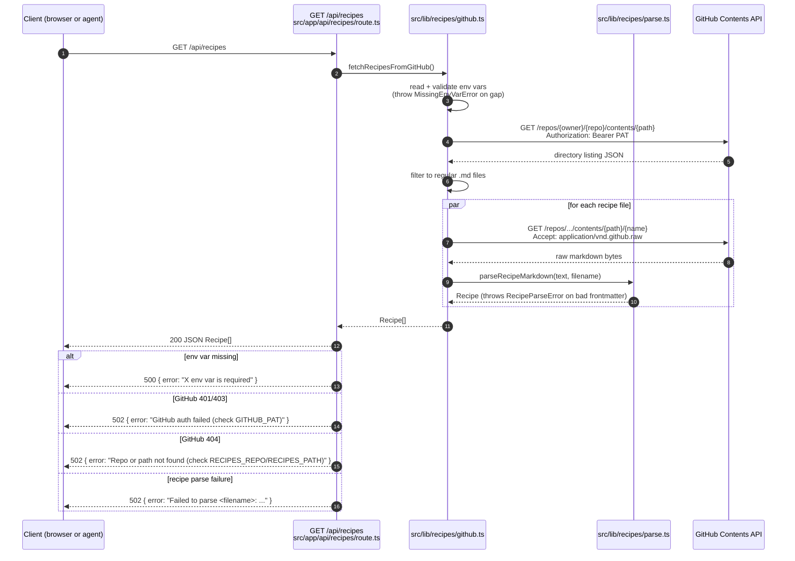

# feat: GitHub recipe reader (/api/recipes backed by private repo markdown)

## Overview

First feature landing on the post-strip base. Implements `GET /api/recipes`, which reads markdown recipe files from a private GitHub repo (configured via env vars), parses frontmatter with `gray-matter`, and returns `Recipe[]`. This replaces the deleted Supabase recipe store and becomes the data source for the meal-plan generator (#66), the UI (#67), and the pantry-awareness filter (#69).

---

## Problem Frame

The new stack keeps recipes in a user-owned private GitHub repo as markdown files — each recipe is a standalone, human-editable `.md` with YAML frontmatter. This is a deliberate shift away from a database: recipes should be portable, grep-able, diffable, and edited in any editor. The trade-off is that the app needs a read path that walks a GitHub directory, parses each file, and assembles a normalized shape.

The feature is bounded by issue #64's explicit contract: one `GET` endpoint, one `Recipe` interface, three env vars, and a fixed set of failure modes. No pagination, no mutation, no caching — those stay out until downstream features need them.

Origin issue: https://github.com/dancj/meal-assistant/issues/64

---

## Requirements Trace

- R1. `GET /api/recipes` returns a JSON array of `Recipe` objects parsed from the markdown files in `RECIPES_PATH` inside `RECIPES_REPO`.
- R2. `Recipe` has exactly: `title: string`, `tags: string[]`, `kidVersion: string | null`, `content: string`, `filename: string` (matching the issue's declared shape).
- R3. `kidVersion` is populated from frontmatter key `kid_version`; when the key is absent, `kidVersion` is `null` (not omitted, not `undefined`).
- R4. `content` is the markdown body **after** the frontmatter block (what `gray-matter` returns as `content`), not the raw file.
- R5. `filename` is the basename of the source file (e.g., `chicken-tacos.md`), taken from the GitHub contents listing.
- R6. Directory traversal is non-recursive and ignores anything that is not a regular file ending in `.md`. Subdirectories, symlinks, images, `README.md`-style non-recipes, and dotfiles are skipped.
- R7. Env-var errors surface as HTTP 500 with a clear message naming the missing variable (`GITHUB_PAT`, `RECIPES_REPO`, or `RECIPES_PATH`).
- R8. Upstream GitHub errors surface as HTTP 502 with a clear message distinguishing (a) auth failure (401/403), (b) repo/path not found (404), and (c) any other non-2xx response.
- R9. A recipe file with missing `title` frontmatter — or frontmatter where `tags` exists but is not an array — surfaces as HTTP 502 and names the offending filename in the error, rather than being silently dropped.
- R10. `.env.example` advertises the three new env vars (`GITHUB_PAT`, `RECIPES_REPO`, `RECIPES_PATH`) with safe placeholder values and a one-line description.
- R11. `CLAUDE.md`'s "Active Work" list for #64 continues to point at this endpoint and the env vars remain accurate after merge.
- R12. `npm run lint`, `npm test`, `npx tsc --noEmit`, and `npm run build` all succeed.

---

## Scope Boundaries

- No caching layer, no ETag support, no revalidation strategy. Each request fetches fresh from GitHub.
- No write path (`POST`/`PUT`/`DELETE`). Recipe authoring happens by editing the private repo directly; #68 will add a separate log-writer endpoint that's orthogonal.
- No pagination or filtering query params. The endpoint returns the full list; filtering by tag/search lands with the UI (#67) or the generator (#66), client-side.
- No recursive directory walking. Recipes live at one path depth; subdirectories are ignored rather than traversed.
- No auth on the `/api/recipes` endpoint itself. The app is single-household; any protection added later belongs at the Vercel/deployment layer, not in this route. The old `CRON_SECRET` bearer check is explicitly not reintroduced.
- No support for recipe-image assets stored alongside the markdown. Frontmatter may reference images via URL, but this endpoint does not fetch or inline them.
- No SWR/React-Query client-side data hook — that lands with the UI (#67).

---

## Context & Research

### Relevant Code and Patterns

- **Route convention.** Next.js 15 App Router: routes live at `src/app/api/<name>/route.ts` and export named HTTP verb handlers (`export async function GET(request: Request)`). No current routes exist after the strip, so this route establishes the in-repo pattern. Use `NextResponse.json(...)` (or plain `Response.json(...)`) with explicit status codes for errors.
- **Lib structure.** `src/lib/` currently holds small single-responsibility modules (`email.ts`, `resend.ts`, `utils.ts`). Follow that style: colocate the recipe module under `src/lib/recipes/` as a small cluster (`types.ts`, `parse.ts`, `github.ts`) so pure parsing and side-effectful fetching are separately testable.
- **Test conventions.** `src/lib/email.test.ts` is the template: Vitest `describe`/`it`, `expect(...).toEqual(...)` / `.toThrow(...)`, no mocks required for pure functions. `vitest.config.ts` runs under `environment: "node"`, which means `fetch` is the platform global — no `jsdom` involvement on the server tests.
- **Strict-mode TS + test exclusion.** `tsconfig.json` has `strict: true` and excludes `**/*.test.ts` from the build. The production bundle sees only the non-test code; tests can import implementation freely via `@/*` alias.
- **Env-var access pattern.** `src/lib/resend.ts` demonstrates the "read `process.env.X` lazily and throw a clear `Error` with the var name if missing" pattern. Reuse that for `GITHUB_PAT`/`RECIPES_REPO`/`RECIPES_PATH`.
- **No existing HTTP client wrapper.** Nothing in `src/lib/` wraps `fetch`. Use `fetch` directly — a thin helper in `src/lib/recipes/github.ts` for building the authenticated request is sufficient.

### Institutional Learnings

- `~/.claude/projects/-Users-developer-projects-meal-assistant/memory/feedback_no_pii_in_public_repo.md`: `.env.example` and docs must use placeholder values (`your-username/your-recipes`, `your-github-pat`), never personal identifiers. Apply when writing U1 and U5.
- `docs/plans/2026-04-22-001-refactor-strip-old-stack-plan.md`: the strip plan explicitly deferred new env vars to "the feature that consumes them." This plan is the first consumer; it owns adding `GITHUB_PAT`, `RECIPES_REPO`, `RECIPES_PATH`.
- `docs/plans/2026-04-22-002-refactor-post-strip-residuals-plan.md`: the residuals plan established the convention that `CLAUDE.md` lists each open issue with its endpoint + env vars. Keeping that list accurate is explicitly in scope (R11) so future agents have a current map.

### External References

- GitHub REST API — Get repository content: https://docs.github.com/en/rest/repos/contents (directory response shape + per-file response with `Accept: application/vnd.github.raw` for raw bytes on private repos).
- `gray-matter` (YAML frontmatter parser): https://github.com/jonschlinkert/gray-matter — returns `{ data, content, excerpt }`. `data.tags` is whatever YAML produced (array, string, undefined).
- GitHub PAT rate limits: 5000 requests/hour for authenticated requests. A household-sized recipe collection (<100 files) issues ≤100 requests per page load; well under the ceiling.

---

## Key Technical Decisions

- **Two-step fetch via the Contents API, not raw.githubusercontent.com.** For private repos, raw GitHub URLs require token-as-query-param auth (brittle) or fail outright. The Contents API accepts a Bearer PAT header, returns a JSON directory listing at a path, and — with `Accept: application/vnd.github.raw` — returns raw file bytes for a file path. Use the same auth + base URL for both steps; avoid any token-in-URL pattern.
- **Parallel per-file fetches after the listing.** Once the directory listing is in hand, fetch all recipe files concurrently with `Promise.all`. Sequential fetching would multiply latency by N with no benefit; the GitHub API happily serves parallel authenticated requests well under the rate limit.
- **Fail loud on malformed recipes.** If any file is missing `title` frontmatter or has non-array `tags`, fail the entire request with a 502 that names the bad filename. Silently skipping would mask user error; #64's "done when" includes "errors surface clearly." Partial success is worse than no success for debugging.
- **Split parsing from fetching.** `src/lib/recipes/parse.ts` is a pure function (`string → Recipe` minus `filename`). `src/lib/recipes/github.ts` does all I/O. The route handler composes the two. This keeps the parser trivially testable with inline fixture strings and the fetcher testable with stubbed `fetch`.
- **Route handler stays thin.** `src/app/api/recipes/route.ts` only: reads env, calls `fetchRecipesFromGitHub`, catches known error classes, shapes the response. All recipe logic lives in `src/lib/recipes/`.
- **Named error classes for mapping.** Throw a small set of named `Error` subclasses from `github.ts` (`MissingEnvVarError`, `GitHubAuthError`, `GitHubNotFoundError`, `GitHubUpstreamError`, `RecipeParseError`). The route handler uses `instanceof` to map each to the right HTTP status. This avoids string-matching error messages or leaking stack traces.
- **Non-recursive, .md-only, file-type-only.** Directory listings include `type: "dir" | "file" | "symlink" | "submodule"`. Accept only `type === "file"` whose `name` ends in `.md` and does not start with `.`. Everything else is silently filtered from the listing — that filter is not a user error, it's just "these aren't recipes."
- **Path normalization.** `RECIPES_PATH` is trimmed and stripped of leading/trailing slashes before being interpolated into the URL. Allow an empty string to mean "repo root" but require the env var to be *set* (even if empty) so "missing env" stays distinct from "root path."

---

## Open Questions

### Resolved During Planning

- **Which API shape — Contents API, Git Trees API, or download URLs?** Contents API for both list and file, with the raw Accept header for files. Trees API adds complexity (SHAs, recursion) with no payoff for one flat directory; `download_url` returns a raw.githubusercontent.com link that doesn't authenticate cleanly against private repos.
- **Should malformed recipes be skipped or fail the request?** Fail (see Key Decisions). Matches the issue's "errors surface clearly" requirement and prevents silent data loss.
- **Is `RECIPES_PATH` required, optional, or defaulted?** Required env var (must be set). Allowed to be empty string for "repo root." Keeps "misconfigured" (missing) distinct from "configured to root" (set and empty).
- **How to represent `kidVersion` when absent?** Explicit `null`, not `undefined` or omitted. The issue declares `kidVersion: string | null`; matching that exactly avoids JSON-serialization ambiguity downstream.
- **Runtime: Node or Edge?** Node. Default Next.js App Router runtime. Edge adds no benefit here (no geographic pinning need) and limits some native APIs; Node is the simpler default and matches the Vitest `environment: "node"` test runtime.

### Deferred to Implementation

- **Exact ESM vs CJS interop for `gray-matter`.** `gray-matter` publishes CJS primarily. Next.js handles interop, but if `import matter from "gray-matter"` fails under strict TS settings, fall back to `import * as matter from "gray-matter"` or tweak the import. Decide once the code touches it.
- **Vercel edge caching headers.** Whether to set `Cache-Control: private, max-age=...` on the response is a rollout/tuning question. For now the route returns fresh data every call; revisit once deploy lands and there's a latency measurement.

---

## High-Level Technical Design

> *This illustrates the intended approach and is directional guidance for review, not implementation specification. The implementing agent should treat it as context, not code to reproduce.*

The diagram names shape; specific signatures and error-class layouts are implementation choices.

---

## Implementation Units

- [ ] U1. **Scaffolding: Recipe type, gray-matter dependency, env-example additions**

**Goal:** Put the three pieces of scaffolding in place that every later unit depends on. No behavior yet — just the type, the library, and the declared env contract.

**Requirements:** R2, R3, R10

**Dependencies:** None

**Files:**
- Create: `src/lib/recipes/types.ts`
- Modify: `package.json` (add `gray-matter` to `dependencies`)
- Modify: `package-lock.json` (as a side effect of `npm install`)
- Modify: `.env.example`

**Approach:**
- `src/lib/recipes/types.ts` exports a `Recipe` interface matching the issue's shape exactly: `title: string`, `tags: string[]`, `kidVersion: string | null`, `content: string`, `filename: string`. No extra fields. No optional fields — callers should not have to handle `undefined` where the issue promises `null`.
- Add `gray-matter` via `npm install gray-matter`. Also add `@types/gray-matter` only if `gray-matter` does not ship its own types (check on install).
- `.env.example` gains three entries grouped under a `# GitHub recipe store (#64)` comment: `GITHUB_PAT=your-github-pat`, `RECIPES_REPO=your-username/your-recipes`, `RECIPES_PATH=recipes`. Use generic placeholder values per the public-repo-generic learning.

**Patterns to follow:**
- `.env.example`'s existing `# Resend (optional — only needed if email delivery is enabled via #70)` comment style.
- `src/lib/utils.ts` — single-file, single-purpose module in `src/lib/`.

**Test scenarios:**
- Test expectation: none — this unit only installs a dependency, declares a type, and adds env placeholders. No runtime behavior is introduced. U2 and U3 exercise the Recipe shape via real parsing/fetching.

**Verification:**
- `src/lib/recipes/types.ts` exists and exports `Recipe` with the five fields in the exact types the issue declares.
- `npm ls gray-matter` shows the package installed.
- `.env.example` contains all three new keys with placeholder values; no personal identifiers.
- `npm run build` succeeds (confirms the new type file compiles under strict TS).

---

- [ ] U2. **Pure parser: `parseRecipeMarkdown(source, filename)`**

**Goal:** A pure function that takes a markdown string and a filename, parses frontmatter with `gray-matter`, and returns a `Recipe`. No I/O, no env reads, no globals. Throws a named `RecipeParseError` for malformed input.

**Requirements:** R2, R3, R4, R9

**Dependencies:** U1

**Files:**
- Create: `src/lib/recipes/parse.ts`
- Create: `src/lib/recipes/parse.test.ts`
- Modify: `src/lib/recipes/types.ts` (add `RecipeParseError` class export, unless placed in a separate `errors.ts` — implementer's call)

**Approach:**
- Signature: takes the raw markdown `source` (string) and `filename` (string), returns `Recipe`.
- Calls `gray-matter` once. From the result's `data`:
  - `title`: required string; throw `RecipeParseError` if missing, empty, or not a string.
  - `tags`: if absent → `[]`. If present and an array of strings → use as-is. If present and not an array, or not all strings → throw `RecipeParseError`.
  - `kid_version`: optional; if present must be a non-empty string, mapped to `kidVersion`; if absent → `null`.
- `content`: `gray-matter`'s `.content` field (post-frontmatter body), trimmed of leading whitespace but preserving interior formatting.
- `filename`: passed through from the argument. The parser never reads from disk or URL — it is told what file it's representing.
- `RecipeParseError` subclasses `Error`, carries `filename` and original `message`, and prefixes its `.message` with the filename (`"chicken-tacos.md: title frontmatter is required"`).

**Execution note:** Implement test-first. The parser has a tight contract with many small branches; a failing-test-first pass catches off-by-one frontmatter cases early.

**Patterns to follow:**
- `src/lib/email.ts#parseRecipients`: small, pure, throws `Error` with a clear message; no global state. Keep `parse.ts` in that spirit.

**Test scenarios:**
- Happy path: full frontmatter (title, tags array, kid_version) + body → `Recipe` with all fields populated; `kidVersion` matches the string.
- Happy path: frontmatter with only `title` and `tags` (no `kid_version` key at all) → `Recipe` with `kidVersion: null` and the right tags array.
- Happy path: frontmatter with `kid_version:` present but with no value (YAML parses this as `null`) → `Recipe` with `kidVersion: null`. Treated the same as "key absent."
- Happy path: frontmatter with `title` only, no `tags` key → `Recipe` with `tags: []`, `kidVersion: null`.
- Edge case: `tags: []` explicitly → `Recipe` with empty array (not `null`, not missing).
- Edge case: body contains multiple `---` lines after the frontmatter block → `content` preserves those; only the leading YAML block is stripped.
- Edge case: frontmatter with CRLF line endings → parses correctly (gray-matter handles this, but cover it so a future library swap doesn't regress).
- Edge case: `kid_version: ""` (empty string) → throws `RecipeParseError` (explicit empty is user error; use the key or omit it).
- Error path: missing frontmatter block entirely → throws `RecipeParseError` naming missing `title`.
- Error path: frontmatter present but no `title` key → throws `RecipeParseError` naming the filename.
- Error path: `title` not a string (e.g., number) → throws `RecipeParseError`.
- Error path: `tags` not an array (e.g., a string `"quick, mexican"`) → throws `RecipeParseError`. YAML coerces easily; the error must fire so users fix their file.
- Error path: `tags` is an array containing non-strings (e.g., `[1, 2]`) → throws `RecipeParseError`.
- Error path: `RecipeParseError.message` begins with the passed `filename`.

**Verification:**
- `parseRecipeMarkdown` is exported from `src/lib/recipes/parse.ts` and importable via `@/lib/recipes/parse`.
- All test scenarios above pass.
- `npx tsc --noEmit` clean — the function's signature is fully typed without `any`.

---

- [ ] U3. **GitHub fetcher: `fetchRecipesFromGitHub()`**

**Goal:** The side-effectful function that reads env, talks to GitHub, composes with the parser, and returns `Recipe[]`. Throws named errors for each failure class so the route handler can map them to HTTP status codes.

**Requirements:** R1, R5, R6, R7, R8, R9

**Dependencies:** U1, U2

**Files:**
- Create: `src/lib/recipes/github.ts`
- Create: `src/lib/recipes/github.test.ts`
- Modify: `src/lib/recipes/types.ts` (add error classes `MissingEnvVarError`, `GitHubAuthError`, `GitHubNotFoundError`, `GitHubUpstreamError` — or in a sibling `errors.ts`)

**Approach:**
- Signature: takes no arguments, returns `Promise<Recipe[]>`. Reads env at call time (not module load) so tests can stub it per-case.
- Env validation: read `GITHUB_PAT`, `RECIPES_REPO`, `RECIPES_PATH`. If any is `undefined` or `null` (but not empty string for `RECIPES_PATH`), throw `MissingEnvVarError` naming the var.
- URL construction: base `https://api.github.com/repos/${RECIPES_REPO}/contents/${normalizedPath}`. Normalize the path by trimming and stripping leading/trailing `/`.
- Listing request: GET with headers `Authorization: Bearer ${GITHUB_PAT}`, `Accept: application/vnd.github+json`, `X-GitHub-Api-Version: 2022-11-28`, and a descriptive `User-Agent: meal-assistant`.
  - Status 401/403 → `GitHubAuthError`.
  - Status 404 → `GitHubNotFoundError`.
  - Any other non-2xx → `GitHubUpstreamError` with the status code in the message.
- Filter listing: keep only entries where `type === "file"`, `name.endsWith(".md")`, and `!name.startsWith(".")`.
- Per-file fetch: for each kept entry, GET the file's Contents API URL using the `url` field from the listing item (always present on Contents API directory responses — already URL-encoded by GitHub, so no client-side encoding needed) with `Accept: application/vnd.github.raw` + the same auth header. Same error mapping as listing, except a per-file 404 is still `GitHubUpstreamError` (listing promised this file; a mid-flight 404 is an upstream anomaly, not a config error).
- Fetches run in parallel via `Promise.all`. If any file throws, the whole call rejects — no partial results.
- Each raw body goes through `parseRecipeMarkdown(text, entry.name)`. Parser errors propagate as-is (they're already `RecipeParseError`).

**Patterns to follow:**
- `src/lib/resend.ts`: lazy env read + throw a clear named error with the env var name when missing. Mirror the shape, with the richer error class for this domain.

**Test scenarios:**
- Happy path: stub `fetch` to return a 2-file directory listing then two raw markdowns → returns an array of two `Recipe` objects in order; each has the correct `filename`.
- Happy path: directory listing includes a mix (a regular `.md` file, a subdirectory whose *name* happens to end in `.md` but has `type: "dir"`, a `.jpg` file, and a `README.md` file) → only regular files ending in `.md` are fetched. The `.md`-named subdirectory is filtered out by `type === "file"`, not by its name. A `README.md` *is* fetched and treated as a recipe; if the user puts one in the recipes folder they should expect it to be parsed (document this in CLAUDE.md as a convention).
- Edge case: empty directory listing → returns `[]` without making per-file requests.
- Edge case: `RECIPES_PATH` is `""` (empty string) → URL built as `/repos/owner/repo/contents/` (trailing slash acceptable) and request is made against repo root.
- Edge case: `RECIPES_PATH` is `"recipes/"` (trailing slash) → normalized to `recipes` in the URL.
- Edge case: directory has 20 files → all 20 are fetched concurrently (verify via mock that all fetch calls happen before the first resolves).
- Error path: `GITHUB_PAT` is undefined → throws `MissingEnvVarError` with message including `"GITHUB_PAT"`.
- Error path: `RECIPES_REPO` is undefined → throws `MissingEnvVarError` with message including `"RECIPES_REPO"`.
- Error path: `RECIPES_PATH` is undefined → throws `MissingEnvVarError` with message including `"RECIPES_PATH"`.
- Error path: listing request returns 401 → throws `GitHubAuthError`.
- Error path: listing request returns 403 → throws `GitHubAuthError`.
- Error path: listing request returns 404 → throws `GitHubNotFoundError`.
- Error path: listing request returns 500 → throws `GitHubUpstreamError` with `"500"` in the message.
- Error path: per-file request returns 404 mid-flight (after listing succeeded) → throws `GitHubUpstreamError`, not `GitHubNotFoundError` (reserving `GitHubNotFoundError` for the config-level "repo or path doesn't exist" case).
- Error path: per-file content has invalid frontmatter → throws `RecipeParseError` from U2; the filename is in the message.
- Integration: `fetchRecipesFromGitHub` composes `parseRecipeMarkdown` on real raw bytes (no parser mock). Stubbing only `fetch` ensures the listing→parse chain is exercised end-to-end inside `github.ts`.

**Verification:**
- `fetchRecipesFromGitHub` is exported and returns typed `Promise<Recipe[]>`.
- All test scenarios above pass.
- Error classes are exported and each test asserts `instanceof` the specific class (not just `Error`).
- `npx tsc --noEmit` clean.

---

- [ ] U4. **Route handler: `GET /api/recipes`**

**Goal:** The thin HTTP layer. Calls `fetchRecipesFromGitHub`, maps each named error class to the right status code, returns JSON.

**Requirements:** R1, R7, R8

**Dependencies:** U3

**Files:**
- Create: `src/app/api/recipes/route.ts`
- Create: `src/app/api/recipes/route.test.ts`

**Approach:**
- Export `async function GET()` — no `request` parameter needed for now (no query params in scope).
- `try { const recipes = await fetchRecipesFromGitHub(); return Response.json(recipes); } catch (err) { ... }`.
- Error mapping in the catch:
  - `MissingEnvVarError` → 500 with `{ error: err.message }`.
  - `GitHubAuthError` → 502 with `{ error: "GitHub auth failed (check GITHUB_PAT)" }`.
  - `GitHubNotFoundError` → 502 with `{ error: "Repo or path not found, or PAT lacks access — check RECIPES_REPO, RECIPES_PATH, and GITHUB_PAT scope" }`. GitHub returns 404 both for "this resource doesn't exist" and for "this resource exists but your PAT can't see it" (it refuses to leak private-repo existence). The message must mention all three env vars so the user has all three knobs to check.
  - `GitHubUpstreamError` → 502 with `{ error: "GitHub upstream error: <original message>" }`.
  - `RecipeParseError` → 502 with `{ error: "Failed to parse <filename>: <detail>" }` — the parser already prefixes the filename, so passing `err.message` is enough.
  - Any other `Error` → 500 with `{ error: "Unexpected error fetching recipes" }`. Log the real error server-side; don't leak it to the client.
- Explicit `export const runtime = "nodejs";` — locks the runtime so a future Next default change doesn't silently move this to Edge.
- Do not set cache headers (deferred per Open Questions).

**Patterns to follow:**
- Next.js App Router route handler conventions. No existing in-repo example; follow the Next.js docs pattern for a GET-only resource route.

**Test scenarios:**
- Happy path: stub `fetchRecipesFromGitHub` to resolve with two recipes → `GET` handler returns a `Response` with status 200, JSON body equal to the recipes array.
- Error path: `MissingEnvVarError` → response status 500, body `{ error: <message> }`.
- Error path: `GitHubAuthError` → response status 502, body includes `"GITHUB_PAT"`.
- Error path: `GitHubNotFoundError` → response status 502, body includes `"RECIPES_REPO"`, `"RECIPES_PATH"`, and `"GITHUB_PAT"` (GitHub's 404 is ambiguous between "missing" and "no access", so all three need naming).
- Error path: `GitHubUpstreamError` → response status 502, body includes `"upstream"`.
- Error path: `RecipeParseError` for `chicken-tacos.md` → response status 502, body includes `"chicken-tacos.md"`.
- Error path: an unexpected `TypeError` thrown by the fetcher → response status 500, body is the generic message, and the real error is not leaked in the response body.
- Integration: route.test.ts stubs only `fetchRecipesFromGitHub` (not `fetch` itself). This keeps the route test focused on HTTP-layer mapping, not transport.

**Verification:**
- `src/app/api/recipes/route.ts` exports a `GET` async function and a `runtime = "nodejs"` const.
- All test scenarios above pass.
- Starting the dev server with all three env vars set (to a real or fake repo) returns a response for `curl http://localhost:3000/api/recipes`; with any env var missing the response is a 500 with a clear message.
- `npm run build` succeeds and reports the `/api/recipes` route in the routes manifest.

---

- [ ] U5. **Docs refresh: CLAUDE.md env var list**

**Goal:** Keep `CLAUDE.md` honest now that `GITHUB_PAT`, `RECIPES_REPO`, and `RECIPES_PATH` are live env vars consumed by `/api/recipes`.

**Requirements:** R11

**Dependencies:** U1 (env vars added to `.env.example`), U4 (endpoint exists)

**Files:**
- Modify: `CLAUDE.md`

**Approach:**
- If `CLAUDE.md`'s `Active Work` section already lists #64, update its phrasing to present-tense (the endpoint is implemented, not planned). If the list doesn't mention #64, add it. Either way, the line should describe the `/api/recipes` endpoint and name the three env vars it reads.
- Update the `Environment Variables` section to list the three recipe-related env vars alongside the existing Resend note, with a one-line description each. Keep it generic — no personal identifiers.
- Do not rewrite `README.md` here; getting-started docs can wait until the UI (#67) gives end users a reason to care. Internal agent context is what `CLAUDE.md` serves.

**Patterns to follow:**
- The post-strip `CLAUDE.md`'s existing structure: short bullets under `### Active Work` and `### Environment Variables`, no personal identifiers.

**Test scenarios:**
- Test expectation: none — docs-only change, no behavior.

**Verification:**
- `grep -E "GITHUB_PAT|RECIPES_REPO|RECIPES_PATH" CLAUDE.md` returns three lines.
- `grep -c "#64" CLAUDE.md` is at least 1 (the roadmap mention) and the entry reads as current, not aspirational.

---

## System-Wide Impact

- **Interaction graph:** `src/app/api/recipes/route.ts` is the first route in the new stack. It will be the primary read path called by the generator (#66) and the UI (#67). Keeping the response shape stable matters: any later renaming of `kidVersion` or changing `content`'s formatting would cascade into downstream features.
- **Error propagation:** New named error classes flow from `github.ts` → `route.ts`. Each class maps to exactly one HTTP status. If a future caller catches these directly (e.g., the generator importing `fetchRecipesFromGitHub` without going through HTTP), they get structured errors rather than strings.
- **State lifecycle risks:** None — the endpoint is read-only and stateless. Each call is independent; no partial writes, no caches to invalidate.
- **API surface parity:** This route is the only recipe read path. Future features should call `fetchRecipesFromGitHub` (library) or `/api/recipes` (HTTP), never re-implement GitHub traversal. Note this in the eventual follow-up as a design convention; do not enforce it via ESLint rules in this PR.
- **Integration coverage:** The `github.test.ts` integration scenario (fetch stub + real parser + real error mapping) is the load-bearing test for the common failure modes. Route tests don't need to re-prove the transport layer.
- **Unchanged invariants:** `src/lib/resend.ts`, `src/lib/email.ts`, and `src/lib/utils.ts` remain untouched. `.env.example`'s existing `RESEND_*` block keeps its position and phrasing; the GitHub block is additive.

---

## Risks & Dependencies

| Risk | Mitigation |
|------|------------|
| A user's PAT leaks into logs or error messages. | Never interpolate the PAT into error messages. Error classes carry status codes and generic hints like "check GITHUB_PAT" — they never echo the token value. A grep for `GITHUB_PAT` in the route's error strings should return only literal references to the env var *name*, never the value. |
| Rate-limit exhaustion under sustained load. | Out of scope for this PR but worth noting: authenticated PATs get 5000 req/hr. At N recipes per call, that's 5000/(N+1) concurrent-user-equivalents per hour. For a household app this is unreachable in practice; if the app grows, add a short-TTL in-memory cache in a follow-up. |
| GitHub API shape drift (e.g., response field renamed). | Pin the `X-GitHub-Api-Version: 2022-11-28` header on every request. The Contents API is stable, but the version header prevents silent behavior shifts. |
| `gray-matter` interop quirks under strict ESM. | The library is widely used in Next.js projects; if the default `import matter from "gray-matter"` fails, fall back to `import * as matter from "gray-matter"` or use the compiled `gray-matter/lib/index.js` entry. Decide once the code touches it; defer to implementation. |
| A recipe author adds a subdirectory and expects it to be traversed. | The non-recursive filter is intentional (Scope Boundaries). Document this in `CLAUDE.md` as a convention ("recipes live at one directory depth"). If recursive support is needed later, it's a one-flag addition to `fetchRecipesFromGitHub`, not a rewrite. |
| Recipe filename contains spaces or special characters, breaking URL construction. | Reuse the `url` field from the Contents API directory listing — GitHub returns it pre-encoded. Do not reconstruct the URL client-side from `name`. A test scenario covers `"rôtisserie chicken.md"` to confirm pre-encoded URLs survive round-trip. |

---

## Documentation / Operational Notes

- **Vercel deployment:** Once the route lands, the three env vars must be set in Vercel (Production, Preview, and Development environments). Without them, every request to `/api/recipes` returns 500 with a message naming the missing var — the failure is explicit, not silent.
- **Fine-grained PAT recommendation:** The PAT only needs read access to the single recipe repo. The user should create a *fine-grained* PAT scoped to that repo with Contents: Read permission rather than a classic PAT with full `repo` scope. Note this in the Vercel deploy notes (follow-up issue, not this PR).
- **Local development:** Copy `.env.example` to `.env.local`, fill in a test PAT + repo + path. `npm run dev` picks up `.env.local` automatically. `curl http://localhost:3000/api/recipes` returns the parsed recipes.
- **No rollout/feature flag:** Additive endpoint, no existing users, no migration. Ships directly.

---

## Sources & References

- **Origin issue:** [#64 — GitHub recipe reader: /api/recipes backed by private repo markdown](https://github.com/dancj/meal-assistant/issues/64)
- **Upstream refactor:** [#71 / commit `c09d170`](https://github.com/dancj/meal-assistant/commit/c09d170) — the strip PR that removed the prior Supabase-backed implementation.
- **Post-strip hygiene:** [#72 / commit `90cc6dd`](https://github.com/dancj/meal-assistant/commit/90cc6dd) — the residuals cleanup that removed docs advertising the old stack.
- **Related plans:**
  - `docs/plans/2026-04-22-001-refactor-strip-old-stack-plan.md`
  - `docs/plans/2026-04-22-002-refactor-post-strip-residuals-plan.md`
- **Related code:** `src/lib/email.ts` (parse-style pattern), `src/lib/resend.ts` (lazy env + named error pattern), `src/lib/utils.ts` (small single-file module convention).
- **External docs:**
  - [GitHub REST API — Get repository content](https://docs.github.com/en/rest/repos/contents)
  - [`gray-matter` README](https://github.com/jonschlinkert/gray-matter)
- **Follow-on consumers (context only — no commitments in this plan):** #66 (meal-plan generator, will call `fetchRecipesFromGitHub` or `/api/recipes`), #67 (UI, will call `/api/recipes`), #69 (pantry awareness, filters the same `Recipe[]`).
