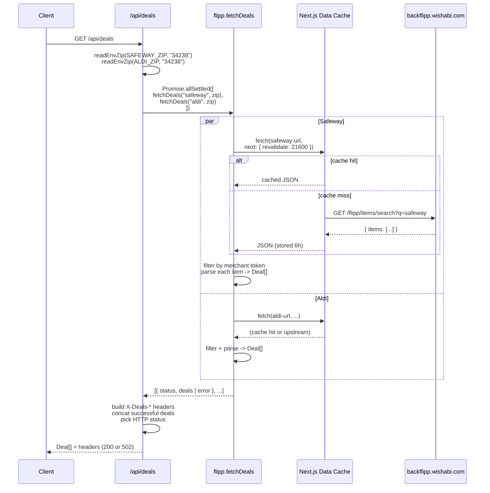

# feat: Deals API (/api/deals for Safeway + Aldi via Flipp backend)

## Overview

Adds `GET /api/deals`, which pulls this week's sale items from Safeway and Aldi via Flipp's unauthenticated flyer search endpoint (`backflipp.wishabi.com`). Both stores are fetched in parallel, tagged, concatenated, and returned as `Deal[]`. Responses are cached for 6 hours (the Wed/Thu flyer cycle) using Next.js's built-in fetch Data Cache, and a cache/status header makes the behavior observable. One store failing does not fail the request — the other store's deals still come through.

This is the second feature landing on the post-strip base. It becomes the store-context input for the meal-plan generator (#66) and the sidebar data source for the UI (#67).

---

## Problem Frame

The meal-plan generator needs grocery context so it can favor recipes whose ingredients are on sale that week. Safeway and Aldi publish their weekly ads through Flipp (`backflipp.wishabi.com/flipp/items/search`), the same backend Kevin Old's [`grocery_deals`](https://github.com/kevinold/grocery_deals) uses for Kroger/Publix. The endpoint accepts a ZIP and a merchant-token query, returns a full flyer, and requires no auth.

Constraints shaping the design:

- **Flyers cycle Wed/Thu.** A 6-hour cache keeps the data fresh without hammering an unofficial endpoint.
- **Flipp field names drift.** Kevin's code keeps fallback keys (e.g., `current_price` / `price` / `sale_price`); this plan does the same.
- **Undocumented upstream.** No SLA, no stable schema — plan accordingly with defensive parsing, a short timeout, and per-store error isolation so one flaky response can't blank the whole endpoint.
- **Household-scale, not prod-scale.** One user, a few requests per day. No horizontal-scaling concerns; Next.js's own fetch cache is enough.

Origin issue: https://github.com/dancj/meal-assistant/issues/65

---

## Requirements Trace

- R1. `GET /api/deals` returns a JSON array of `Deal` objects combining Safeway and Aldi results.
- R2. Each `Deal` has exactly: `productName: string`, `brand: string`, `salePrice: string`, `regularPrice: string`, `promoType: string`, `validFrom: string`, `validTo: string`, `store: 'safeway' | 'aldi'` (matching the issue's declared shape).
- R3. Safeway and Aldi flyers are fetched in parallel. End-to-end latency is the slower of the two network calls, not their sum.
- R4. Each store's flyer response is cached for 6 hours via Next.js's fetch Data Cache (`next: { revalidate: 21600 }`), scoped by ZIP so different ZIP configs get different cache entries.
- R5. Cache behavior is observable on the response: an `X-Deals-Source` header indicates whether the response was served from cache (`cache`), freshly fetched (`network`), or mixed (`mixed`); an `X-Deals-Stores` header lists the stores that returned results.
- R6. When one store fails (network, timeout, or non-2xx), the endpoint still returns 200 with the successful store's deals and an `X-Deals-Errors` header naming the failed store(s). When *both* stores fail, the endpoint returns HTTP 502.
- R7. ZIPs come from `SAFEWAY_ZIP` and `ALDI_ZIP` env vars; both default to `34238` when unset. Invalid ZIP values (empty after trim, non-5-digit) surface as HTTP 500 with a clear message naming the offending var.
- R8. Flipp requests carry an `AbortController` timeout of 10 seconds. A timeout is treated as a per-store failure (see R6), not a 500.
- R9. Deals are filtered to items whose Flipp `merchant` (or `merchant_name`) field contains the merchant token (`safeway` / `aldi`, case-insensitive). Items belonging to nearby stores returned by the same flyer query are excluded.
- R10. Price fields (`salePrice`, `regularPrice`) are strings. If Flipp returns numeric prices, they are stringified verbatim; if a field is missing, the corresponding string is empty (`""`), not `null`/`undefined`.
- R11. `promoType` is one of a small closed set: `bogo`, `multi_buy`, `amount_off`, `percent_off`, `sale`, classified from Flipp's `pre_price_text` / `sale_story` / `post_price_text` fields.
- R12. `.env.example` advertises `SAFEWAY_ZIP` and `ALDI_ZIP` with safe placeholder values (ZIP `34238`, matching the issue's default) and a one-line description each.
- R13. `CLAUDE.md`'s "Active Work" entry for #65 is updated from "planned" to the current endpoint/env-var description after merge.
- R14. `npm run lint`, `npm test`, `npx tsc --noEmit`, and `npm run build` all succeed.

---

## Scope Boundaries

- No other stores. Publix, Kroger, Walmart, etc. are out. Adding a new store is a later issue if the use case demands it.
- No merchant-ID lookup. The plan uses the same token-match approach as the Python reference (`q=safeway` / `q=aldi` in the query, filter by `merchant` field client-side). Issue #65 mentions a Safeway-specific merchant-ID PR being sent to Kevin's repo separately; if merchant-ID lookup turns out to matter for Safeway's flyer, it's a follow-up change, not part of this plan.
- No keyword / category filtering query params. The endpoint returns the full combined flyer; filtering happens downstream (generator #66, UI #67).
- No pagination. Flipp returns a single-page flyer; if it ever exceeds what the upstream returns in one call, revisit.
- No client-side SWR/React-Query hook. UI consumption lands with #67.
- No auth. Same single-household posture as `/api/recipes` — any protection belongs at the Vercel/deployment layer, not in the route.
- No per-item hydration. Kevin's code has an optional second-pass call to `backflipp.wishabi.com/flipp/items/{id}` to enrich a deal; we skip it — the flyer response has enough for the meal-plan use case.
- No deal deduplication across stores. A product on sale at both Safeway and Aldi appears twice, tagged once per store. Downstream can dedup if it wants.
- No response-payload cache (only the per-store upstream fetch is cached). Response headers (status, X-Deals-*) are always computed fresh. This is intentional — the cost is negligible and it keeps the observability headers honest.

---

## Context & Research

### Relevant Code and Patterns

- **Route convention.** `src/app/api/recipes/route.ts` is the template: a thin handler that reads env, calls a lib function, catches named error classes via `instanceof`, and maps to HTTP status with `NextResponse.json(...)`. Mirror that shape for `src/app/api/deals/route.ts`.
- **Lib structure.** `src/lib/recipes/` established the pattern: `types.ts` (pure types), `parse.ts` (pure transform), `github.ts` (side-effectful I/O). Colocate the deals module under `src/lib/deals/` with the same split: `types.ts`, `parse.ts`, `flipp.ts`.
- **Env-var access.** `src/lib/recipes/github.ts`'s `requireEnv` helper reads `process.env` lazily inside the fetch function so tests can stub per-case. Deals will use a variant — `readEnvZip(name, default)` — that returns a string with a default, rather than throwing on missing, since ZIPs are optional here.
- **Test patterns.** `src/lib/recipes/github.test.ts` is the template for side-effectful tests: `vi.stubGlobal("fetch", vi.fn(...))` with a per-test responder, `afterEach` teardown, `makeResponse` helper. `src/app/api/recipes/route.test.ts` is the template for route tests: `vi.mock("@/lib/recipes/github", ...)` with `mockResolvedValueOnce` / `mockRejectedValueOnce` per scenario. Follow both.
- **Vitest config.** `vitest.config.ts` runs `environment: "node"`, so `fetch` is the platform global — no jsdom polyfill needed. `globals: true` lets tests use `describe`/`it`/`expect` without imports.
- **Strict-mode TS + test exclusion.** `tsconfig.json` excludes `**/*.test.ts` from the build. Tests can freely import implementation via `@/*` alias; production bundle sees only non-test code.

### Institutional Learnings

- `~/.claude/projects/-Users-developer-projects-meal-assistant/memory/feedback_no_pii_in_public_repo.md`: `.env.example` and docs must use placeholder values (the default ZIP `34238` happens to also be the issue's stated default — it is generic and safe; no rewrite needed). Apply when writing U1 and U5.
- `docs/plans/2026-04-23-001-feat-github-recipes-api-plan.md`: establishes the "thin route + lib split + named error classes + instanceof mapping" pattern this plan reuses wholesale.
- `docs/plans/2026-04-22-002-refactor-post-strip-residuals-plan.md`: established the convention that `CLAUDE.md`'s "Active Work" list carries each open issue's endpoint + env vars. Update the #65 entry when the feature lands (R13).

### External References

- Kevin Old's `grocery_deals.py`: https://github.com/kevinold/grocery_deals/blob/main/grocery_deals.py — authoritative reference for Flipp request shape (`locale=en-us`, `postal_code=<zip>`, `q=<merchant_token>`), response fields, merchant-token matching, promo classification, and field-name fallbacks. Port the field-name fallback list and the promo regex set verbatim.
- Flipp search endpoint (undocumented, discovered via Kevin's repo): `GET https://backflipp.wishabi.com/flipp/items/search?locale=en-us&postal_code=<zip>&q=<merchant>` returns `{ items: [...] }` (or `{ results: [...] }` — both fallback keys exist). No auth. Items contain `merchant`, `merchant_name`, `name`, `brand`, `current_price`, `original_price`, `sale_story`, `pre_price_text`, `post_price_text`, `valid_from`, `valid_to`, `flyer_item_id`.
- Next.js 15 Data Cache: https://nextjs.org/docs/app/building-your-application/caching#data-cache — `fetch(url, { next: { revalidate: <seconds> } })` caches responses for `<seconds>` on Vercel's Data Cache. Works in route handlers. Cache key is the URL + request init; different ZIPs produce different keys automatically.

---

## Key Technical Decisions

- **Use Next.js fetch Data Cache, not a hand-rolled cache.** `fetch(url, { next: { revalidate: 21600 } })` gives us the 6-hour TTL for free, deployed-instance-shared on Vercel, keyed automatically by full URL. A module-level `Map` cache would be per-instance and would not survive serverless cold starts — a fresh lambda every ~15 minutes blows up the cache. Next's Data Cache is the right primitive.
- **One fetch per store, filter client-side.** `q=safeway` returns nearby stores too (Flipp behavior). Filter to items whose `merchant` field case-insensitively contains `safeway`. Avoids a separate merchant-ID lookup call and matches Kevin's approach exactly.
- **`Promise.allSettled`, not `Promise.all`.** Partial failure is a first-class requirement (R6). `allSettled` lets us tag each store's outcome and build the response + headers from the per-store results. `Promise.all` short-circuits on the first rejection and kills the partial-success path.
- **Named error classes for route mapping.** `FlippUpstreamError` (non-2xx), `FlippNetworkError` (fetch threw, including timeout), `InvalidZipError` (env-var validation). The route maps each via `instanceof` to 500 / 502 — same pattern as recipes. All-store failure aggregates two per-store errors into a single 502.
- **10-second per-request timeout via `AbortController`.** Flipp is unauthenticated and occasionally flaky; an unbounded fetch can hang a serverless lambda. 10s is comfortably above the p99 of the Python reference's 20s budget for our use case and leaves time to try the other store if we stagger (we don't — they run in parallel). A timeout surfaces as `FlippNetworkError`.
- **Prices are pass-through strings.** Flipp sometimes returns numbers, sometimes strings (`"2.99"`, `2.99`, `"2/$5.00"`). The `Deal` type is `salePrice: string` per the issue; the parser coerces with `String(value ?? "")` and trusts the UI to render whatever shape Flipp handed it. Numeric reasoning is out of scope.
- **Promo classification mirrors Kevin's regexes.** Port the five-way classifier (`bogo`, `multi_buy`, `amount_off`, `percent_off`, `sale`) as-is. Adapting regex families is not worth the marginal quality; the behavior is already known-good in Kevin's repo.
- **Split pure parsing from I/O.** `src/lib/deals/parse.ts` is pure: `(rawItem, merchantToken) -> Deal`. `src/lib/deals/flipp.ts` owns all network + caching + per-store orchestration. The route composes them. This lets parser tests use inline fixture objects, and fetcher tests stub `fetch`.
- **Cache-observability via response headers, not body envelope.** The issue contract is `Deal[]` — a bare array — so we don't wrap in `{ deals, meta }`. Cache/source/status information goes on response headers (`X-Deals-Source`, `X-Deals-Stores`, `X-Deals-Errors`), keeping the JSON body exactly the shape the issue specified.
- **No retries.** Kevin's Python code uses urllib3 retries. On serverless, retries add lambda time and don't recover from the class of failures we actually hit (upstream rate-limiting, schema drift). One shot per store, then `allSettled` absorbs the loss.

---

## Open Questions

### Resolved During Planning

- **Caching mechanism — hand-rolled or Next.js built-in?** Next.js fetch Data Cache with `revalidate: 21600`. See Key Technical Decisions.
- **Merchant matching — token or ID lookup?** Token match on the `merchant` field, same as Kevin. Merchant-ID lookup is out of scope; revisit if Safeway's token match proves unreliable.
- **Partial-failure response shape?** 200 + `X-Deals-Errors` header naming failed stores; 502 only when all fail. Body stays `Deal[]`.
- **ZIPs required or optional?** Optional; both default to `34238` per issue. Validation is "non-empty, 5 digits"; anything else is 500 `InvalidZipError`.
- **Price fields — string or number?** String per issue contract. Parser stringifies whatever Flipp returned.
- **Should `promoType` be classified or raw?** Classified into the five-way set (`bogo | multi_buy | amount_off | percent_off | sale`). Keeps the shape predictable for the downstream generator.

### Deferred to Implementation

- **Exact shape of Flipp response for Safeway ZIP `34238`.** The Python reference is the spec, but Safeway may surface fields slightly differently from Kroger/Publix. The parser's fallback-key list is the guard; if something unexpected shows up, extend the fallback list rather than rewriting the shape. Confirm with a live call during U2.
- **Whether `X-Deals-Source` can accurately distinguish `cache` vs. `network` under Next.js Data Cache.** Next.js doesn't directly expose cache-hit metadata to the route handler. The plan's approach is to time each fetch and treat sub-50ms responses as cache hits — good enough for observability, not a security claim. If this proves unreliable in practice, drop the header and log cache state instead.
- **What `.env.example` placeholder to use.** `34238` is the issue's stated default and is generic enough to double as a placeholder; revisit only if we want to separate "default in code" from "example in dotenv."

---

## High-Level Technical Design

> *This illustrates the intended request/response shape and is directional guidance for review, not implementation specification. The implementing agent should treat it as context, not code to reproduce.*

The key shape points: per-store outcomes are independent, headers describe the multi-store result, body is a flat concatenated array of tagged deals.

---

## Implementation Units

- [ ] U1. **Deals types, merchant config, and env scaffolding**

**Goal:** Establish the `Deal` type, merchant-config constants (tokens, default ZIP, promo-type enum), and the env-var reader helpers. No network, no parsing logic — only the shared vocabulary subsequent units depend on.

**Requirements:** R2, R7, R11, R12

**Dependencies:** None

**Files:**
- Create: `src/lib/deals/types.ts` — `Deal` interface (matching R2 exactly), `Store` union (`'safeway' | 'aldi'`), `PromoType` union (`'bogo' | 'multi_buy' | 'amount_off' | 'percent_off' | 'sale'`), `MERCHANTS` const mapping `Store` → `{ token: string, displayName: string }`, `DEFAULT_ZIP = '34238'`
- Create: `src/lib/deals/env.ts` — `readEnvZip(name, fallback)` helper that reads `process.env[name]`, trims, returns `fallback` when empty, throws `InvalidZipError` when set-but-not-5-digits
- Create: `src/lib/deals/errors.ts` — `InvalidZipError`, `FlippNetworkError`, `FlippUpstreamError` subclasses (each carrying `varName` / `store` / `status` for error-message composition)
- Create: `src/lib/deals/env.test.ts` — env helper tests
- Modify: `.env.example` — add `SAFEWAY_ZIP=34238` and `ALDI_ZIP=34238` with one-line comments
- Modify: `CLAUDE.md` — update the #65 line in "Active Work" from planned to implemented (can also land in U5; pick whichever commit is cleaner)

**Approach:**
- Colocate errors in a dedicated module so both `flipp.ts` and `route.ts` can import without cycles.
- Keep the promo-type union and merchant config in `types.ts` — they are pure data.
- `readEnvZip` returns `string` (always), never `undefined`. Callers can trust the value.

**Patterns to follow:**
- Env-var + named-error pattern from `src/lib/recipes/github.ts` (specifically the `requireEnv` + `MissingEnvVarError` shape).
- Type-module colocation from `src/lib/recipes/types.ts`.

**Test scenarios:**
- Happy path: `readEnvZip("FOO", "34238")` returns `"34238"` when `FOO` unset. Covers R7.
- Happy path: `readEnvZip("FOO", "34238")` returns `"12345"` when `process.env.FOO = "12345"`. Covers R7.
- Edge case: `readEnvZip("FOO", "34238")` returns `"34238"` when `process.env.FOO = ""` (empty after trim — treated as unset).
- Edge case: `readEnvZip("FOO", "34238")` returns `"34238"` when `process.env.FOO = "   "` (whitespace-only).
- Error path: `readEnvZip("FOO", "34238")` throws `InvalidZipError` when `process.env.FOO = "abc"` (non-numeric). Error carries `varName: "FOO"`.
- Error path: `readEnvZip("FOO", "34238")` throws `InvalidZipError` when `process.env.FOO = "1234"` (four digits).
- Error path: `readEnvZip("FOO", "34238")` throws `InvalidZipError` when `process.env.FOO = "123456"` (six digits).

**Verification:**
- `Deal`, `Store`, `PromoType` exported from `src/lib/deals/types.ts` with the exact shape in R2.
- `npx tsc --noEmit` passes.
- `.env.example` shows the two new vars with the documented default.
- `src/lib/deals/env.test.ts` covers unset, empty, valid, and invalid cases.

---

- [ ] U2. **Flipp item parser (pure transform)**

**Goal:** Pure function that takes a single raw Flipp item object plus a store tag and returns a `Deal` — or signals "this item doesn't belong to this merchant" (caller filters it out). No I/O, no caching.

**Requirements:** R2, R9, R10, R11

**Dependencies:** U1

**Files:**
- Create: `src/lib/deals/parse.ts` — `parseFlippItem(rawItem, store): Deal | null` (returns `null` when the item's `merchant`/`merchant_name` does not contain the store's token); `classifyPromo(pre, story, post): PromoType`; `firstNonEmpty(obj, keys, fallback)` helper for field-name fallback
- Create: `src/lib/deals/parse.test.ts` — parser + classifier tests using inline Flipp-shaped fixtures

**Approach:**
- Port field-name fallbacks from the Python reference: `current_price | price | sale_price` for `salePrice`; `original_price | regular_price | was_price | list_price` for `regularPrice`; `name | title | display_name` for `productName`; `brand | manufacturer` for `brand`; `valid_from | validFrom | start_date` for `validFrom`; `valid_to | validTo | end_date` for `validTo`; `pre_price_text | prePriceText`, `sale_story | saleStory`, `post_price_text | postPriceText` for promo classification.
- Coerce missing/undefined/null string fields to `""` (R10). Coerce numeric prices via `String(value)`.
- `classifyPromo` matches Python's regex set: BOGO first (`bogo|b1g1|buy one get one|buy 1 get 1`), then multi-buy (`N for $M`, `buy N get M`), then amount-off (`save $N`), then percent-off (`N% off`). Default `sale`.
- `parseFlippItem` returns `null` for items whose merchant field does not case-insensitively contain the store's token — the caller uses `.filter(Boolean)` to drop them. This keeps filter + parse in one pass.

**Patterns to follow:**
- Pure-parser style from `src/lib/recipes/parse.ts` (no I/O, throws named errors, fully testable with fixtures).
- Field-fallback helper from Kevin's `_first` function (see `grocery_deals.py`).

**Test scenarios:**
- Happy path: well-formed Flipp item with all primary fields → `Deal` with every string field populated and `store` tagged correctly.
- Happy path: item with `price` instead of `current_price` → `salePrice` still populated (fallback works).
- Happy path: item with `regularPrice` missing entirely → `Deal.regularPrice === ""`.
- Happy path: item with numeric `current_price: 2.99` → `Deal.salePrice === "2.99"`.
- Edge case: item where `merchant: "Publix Super Markets"` and store is `safeway` → `parseFlippItem` returns `null`.
- Edge case: item where `merchant: "SAFEWAY INC"` (uppercase) and store is `safeway` → returns a `Deal` (case-insensitive token match).
- Edge case: item where `merchant` missing but `merchant_name: "Safeway"` → returns a `Deal` (fallback key works).
- Edge case: item with both `merchant` and `merchant_name` missing → returns `null`.
- Happy path: `classifyPromo("", "BOGO on chicken", "")` → `"bogo"`.
- Happy path: `classifyPromo("", "2 for $5", "")` → `"multi_buy"`.
- Happy path: `classifyPromo("", "Save $2.00", "")` → `"amount_off"`.
- Happy path: `classifyPromo("", "25% off", "")` → `"percent_off"`.
- Edge case: `classifyPromo("", "", "")` → `"sale"` (default).
- Edge case: `classifyPromo("buy one get one free", "", "")` → `"bogo"` (variant phrasing).
- Happy path: `firstNonEmpty({ a: "", b: null, c: "x" }, ["a", "b", "c"], "fallback")` → `"x"`.
- Edge case: `firstNonEmpty({}, ["a"], "fallback")` → `"fallback"`.

**Verification:**
- `src/lib/deals/parse.test.ts` covers every fallback key and promo-type branch.
- A parsed `Deal` passed to `JSON.stringify` yields exactly the R2 field set.

---

- [ ] U3. **Flipp fetcher with per-store caching and timeout**

**Goal:** `fetchDealsFromFlipp(store, zip): Promise<Deal[]>` — calls Flipp's search endpoint for one store, applies the 6-hour Next.js Data Cache, enforces a 10-second timeout, filters + parses the response into `Deal[]`. Throws `FlippUpstreamError` on non-2xx and `FlippNetworkError` on network/timeout failure.

**Requirements:** R3, R4, R8, R9

**Dependencies:** U1, U2

**Files:**
- Create: `src/lib/deals/flipp.ts` — `fetchDealsFromFlipp(store, zip)`; internal URL builder; `AbortController`-based timeout wrapper
- Create: `src/lib/deals/flipp.test.ts` — fetcher tests using `vi.stubGlobal("fetch", ...)`

**Approach:**
- URL: `https://backflipp.wishabi.com/flipp/items/search?locale=en-us&postal_code=<zip>&q=<merchant-token>`.
- Pass `{ next: { revalidate: 21600 } }` to `fetch`. Next.js's Data Cache keys off the full URL + init, so per-ZIP cache entries fall out naturally.
- Wrap `fetch` in an `AbortController` with a 10s `setTimeout(() => controller.abort(), 10_000)`. On abort, throw `FlippNetworkError` with `cause` set to the abort reason.
- Read response JSON, extract `items` (or `results` as fallback), map through `parseFlippItem`, drop `null`s.
- On non-2xx, throw `FlippUpstreamError(status, store)`. Do not read the body as JSON — the body may be HTML for cases like 5xx from the CDN.
- No retries (see Key Technical Decisions).

**Execution note:** Confirm the live Flipp response shape for Safeway ZIP `34238` before locking in the test fixtures — the issue explicitly calls this out as step 1 of the implementation order. Use the confirmed raw response as the happy-path fixture.

**Patterns to follow:**
- Fetcher + named-error style from `src/lib/recipes/github.ts` (throws `GitHubUpstreamError` for non-2xx; route maps).
- Fetch mocking style from `src/lib/recipes/github.test.ts` (`vi.stubGlobal("fetch", vi.fn(...))`, per-test responder, `makeResponse` helper).

**Test scenarios:**
- Happy path: happy Flipp response with two Safeway items and one Publix item → returns a `Deal[]` of length 2, both tagged `store: "safeway"`. Covers R9.
- Happy path: `fetchDealsFromFlipp("aldi", "12345")` is called → the fetched URL contains `postal_code=12345` and `q=aldi`.
- Happy path: fetch options include `next: { revalidate: 21600 }`. Covers R4.
- Edge case: Flipp response uses `results` instead of `items` → fetcher still returns the parsed deals (fallback key).
- Edge case: Flipp response has `items: []` → fetcher returns `[]` without throwing.
- Edge case: Flipp response has items but none match the merchant token → fetcher returns `[]`.
- Error path: Flipp responds 500 → throws `FlippUpstreamError` with `status === 500` and `store === "safeway"`.
- Error path: Flipp responds 429 → throws `FlippUpstreamError` with `status === 429`.
- Error path: `fetch` rejects (network failure) → throws `FlippNetworkError` wrapping the original error.
- Error path: `fetch` takes longer than 10 seconds → `AbortController` fires, fetcher throws `FlippNetworkError` with `cause` indicating abort. Covers R8. *(Simulate by making the mocked `fetch` await a promise that resolves slowly; advance time with `vi.useFakeTimers()` + `vi.advanceTimersByTime(10_001)`.)*
- Integration: two sequential calls for the same (store, zip) within a test — since Next's Data Cache is out-of-process, the test verifies only that our wrapper passes through identical URLs and options on both calls (actual cache-hit behavior is a Next.js property). *This is a wiring test, not a cache-hit test — document that plainly.*

**Verification:**
- `src/lib/deals/flipp.test.ts` exercises URL construction, cache-option passing, merchant filtering, fallback response keys, timeout, and both error classes.
- A smoke run against the real Flipp endpoint (`curl` with `postal_code=34238&q=safeway`) returns a non-empty `items` array whose shape matches the fixture (ad-hoc confirmation during implementation per the execution note).

---

- [ ] U4. **Combined-store orchestrator with partial-failure semantics**

**Goal:** `fetchAllDeals({ safewayZip, aldiZip }): Promise<{ deals: Deal[]; perStore: Array<{ store, status, durationMs, error? }> }>` — runs the per-store fetches in parallel with `Promise.allSettled`, returns the concatenated deals plus per-store outcome metadata the route layer uses to build response headers.

**Requirements:** R1, R3, R5, R6

**Dependencies:** U3

**Files:**
- Modify: `src/lib/deals/flipp.ts` — add `fetchAllDeals(...)` at the bottom of the file
- Modify: `src/lib/deals/flipp.test.ts` — add an `describe("fetchAllDeals")` block

**Approach:**
- Record `Date.now()` before each per-store `fetchDealsFromFlipp` and compute `durationMs` on settle. Use `< 50ms` as a heuristic for "served from Next.js Data Cache" — good enough for the `X-Deals-Source` header; not a security claim.
- `Promise.allSettled` returns an array aligned with the input order (safeway, aldi). Build `perStore` in the same order for deterministic output.
- Concatenate successful stores' deals in the same order (safeway first, then aldi). No sorting — downstream decides.
- Return shape is `{ deals, perStore }`; the route builds headers + response from `perStore`.

**Patterns to follow:**
- Parallel-fetch + aggregate pattern from `src/lib/recipes/github.ts`'s `Promise.all` over per-file fetches, adapted for `allSettled` + settled-result flattening.

**Test scenarios:**
- Happy path: both stores succeed → `deals` concatenates both (safeway first), `perStore` has two `status: "fulfilled"` entries. Covers R3, R6.
- Happy path: both stores succeed, both resolve under 50ms (mocked cache-hit duration) → `perStore[i].durationMs < 50` for each. Covers R5.
- Edge case: safeway succeeds, aldi fails with `FlippUpstreamError` → `deals` has only safeway items, `perStore[1].status === "rejected"` with the error preserved. Covers R6.
- Edge case: both stores fail (one `FlippUpstreamError`, one `FlippNetworkError`) → `deals === []`, both `perStore` entries `rejected` with the correct error types. Covers R6.
- Edge case: safeway succeeds with an empty `items` array → `deals === []` (from safeway's side), `perStore[0].status === "fulfilled"`.
- Integration: the two per-store fetches run concurrently (assert via parallel-call observation on the stubbed `fetch` — both calls issued before the first resolves). Covers R3.

**Verification:**
- Partial-failure returns 200 semantics (the orchestrator returns data + metadata; status-code choice lives in U5, which is verified there).
- `perStore` always has exactly two entries in `[safeway, aldi]` order.

---

- [ ] U5. **Route handler + cache-observability headers**

**Goal:** `GET /api/deals` — reads env, calls `fetchAllDeals`, shapes the response (body = `Deal[]`, headers = `X-Deals-*`), maps errors to HTTP status (200 / 502 / 500).

**Requirements:** R1, R5, R6, R7, R13

**Dependencies:** U1, U4

**Files:**
- Create: `src/app/api/deals/route.ts` — `GET` handler
- Create: `src/app/api/deals/route.test.ts` — route tests with `vi.mock("@/lib/deals/flipp", ...)`
- Modify: `CLAUDE.md` — update the #65 "Active Work" entry to the implemented-endpoint form (unless already landed in U1)

**Approach:**
- Read `SAFEWAY_ZIP` and `ALDI_ZIP` via `readEnvZip`; on `InvalidZipError`, return 500 with `{ error: "<VAR> must be a 5-digit ZIP" }`.
- Call `fetchAllDeals({ safewayZip, aldiZip })`.
- Compute headers:
  - `X-Deals-Stores`: comma-joined list of stores with `status === "fulfilled"` (e.g., `"safeway,aldi"` or `"safeway"`).
  - `X-Deals-Errors`: comma-joined list of stores with `status === "rejected"` (header omitted entirely when no errors).
  - `X-Deals-Source`: `"cache"` if all fulfilled stores had `durationMs < 50`, `"network"` if none did, `"mixed"` otherwise, `"unknown"` when zero stores succeeded.
- Compute status:
  - All stores failed → 502 with `{ error: "All deal sources failed", details: [{ store, message }, ...] }` and body is **not** `Deal[]` here (error envelope). Document this explicitly in the response contract.
  - Otherwise → 200 with the `Deal[]` body.
- Never leak the raw `Error` stack to the client; log server-side.

**Execution note:** Start with a failing route test for the three status shapes (all-fulfilled → 200, partial → 200 + X-Deals-Errors, all-rejected → 502). Implement to pass.

**Patterns to follow:**
- Thin-handler + `instanceof` error mapping from `src/app/api/recipes/route.ts`.
- Route-test mocking from `src/app/api/recipes/route.test.ts` (`vi.mock(...)` the lib module, `mockResolvedValueOnce` per scenario, assert on status and body).

**Test scenarios:**
- Happy path: both stores fulfilled with deals → 200, body is `Deal[]` concat, `X-Deals-Stores: "safeway,aldi"`, no `X-Deals-Errors` header. Covers R1, R5, R6.
- Happy path: both stores fulfilled but both `durationMs < 50` → `X-Deals-Source: "cache"`. Covers R5.
- Happy path: both stores fulfilled, one fast one slow → `X-Deals-Source: "mixed"`. Covers R5.
- Happy path: both stores fulfilled, both slow → `X-Deals-Source: "network"`. Covers R5.
- Edge case: safeway fulfilled, aldi rejected → 200, body is safeway deals only, `X-Deals-Stores: "safeway"`, `X-Deals-Errors: "aldi"`. Covers R6.
- Edge case: both rejected → 502, body is `{ error, details }` envelope, `X-Deals-Stores` header omitted or empty, `X-Deals-Errors: "safeway,aldi"`, `X-Deals-Source: "unknown"`. Covers R6.
- Error path: `SAFEWAY_ZIP = "abc"` → 500 with `{ error: "SAFEWAY_ZIP must be a 5-digit ZIP" }`, no call to `fetchAllDeals`. Covers R7.
- Error path: `fetchAllDeals` throws an unexpected error (e.g., `TypeError` from a bug, not one of the named classes) → 500 with `{ error: "Unexpected error" }`; original error is logged. The raw message does not leak.
- Integration: route test mocks `fetchAllDeals` to return a mixed-duration `perStore` payload, asserts body + all four `X-Deals-*` headers together.

**Verification:**
- `curl -i http://localhost:3000/api/deals` against a dev server returns 200, `Content-Type: application/json`, body parses as an array, and response headers include `X-Deals-Stores`. (Confirm manually during implementation.)
- `src/app/api/deals/route.test.ts` covers every status / header combination enumerated above.
- `npm run lint`, `npx tsc --noEmit`, `npm test`, `npm run build` all pass.

---

## System-Wide Impact

- **Interaction graph:** `/api/deals` is a net-new route with no current consumers. Its downstream consumers are #66 (generator) and #67 (UI), both unimplemented. No existing code paths branch on deals.
- **Error propagation:** Per-store errors are absorbed at the orchestrator layer (`allSettled`) and emerge as metadata, not exceptions. Only the all-store-failed case bubbles to a 502. Env-var errors short-circuit before any network I/O.
- **State lifecycle risks:** Next.js Data Cache is keyed by URL; a typo'd ZIP would produce a permanent miss-then-cached-error until the TTL expires. The `InvalidZipError` pre-check (pre-fetch, pre-cache) prevents this.
- **API surface parity:** Only one consumer surface — the HTTP route. No CLI, no background job, no other caller. Keeps blast radius tight.
- **Integration coverage:** The parallel-fetch timing (R3) and the `X-Deals-Source` duration heuristic are behaviors mocks can approximate but not fully prove. Confirm on a real request during U3/U5 implementation and note any deviations in the PR.
- **Unchanged invariants:** `/api/recipes` is untouched. `.env.example`'s existing variables (`GITHUB_PAT`, `RECIPES_REPO`, `RECIPES_PATH`, `RESEND_*`) stay in place; this plan only adds new lines. `package.json` needs no new dependencies — `gray-matter` is for recipes, not deals.

---

## Risks & Dependencies

| Risk | Mitigation |
|------|------------|
| Flipp changes field names (known historical behavior per Kevin's CLAUDE.md). | Parser uses fallback keys everywhere. Adding a new fallback key is a one-line change + test fixture. |
| Flipp returns HTML instead of JSON on upstream failure (CDN error page). | Fetcher checks response status before reading JSON; non-2xx throws `FlippUpstreamError` without touching the body. |
| Flipp rate-limits by IP or adds auth. | Single-household traffic is well under anyone's rate-limit threshold. If it happens, fall back to Flipp's public browser UI scrape (separate issue) or drop the store. |
| Next.js Data Cache does not persist reliably on Vercel's free tier. | 6-hour cache is a performance optimization, not a correctness requirement. A cold cache means each request hits Flipp twice — still cheap and within Flipp's tolerance. Revisit if cold-miss rates become painful. |
| `X-Deals-Source` duration heuristic misclassifies "warm upstream" as "cache hit." | Header is observability, not policy. Under-50ms-equals-cache is good enough for a human looking at `curl -i`; no downstream logic branches on it. Documented explicitly in Deferred Questions. |
| `AbortController` timeout interacts badly with Next.js fetch cache (e.g., cached-response read still counts toward the timeout). | In practice, Data Cache reads are synchronous deserialization well under 10s. If the interaction surfaces, shorten the timeout or wrap only the network-path `fetch` rather than the cached one. |
| Promo-type regex misclassifies a real promo. | Low-impact — misclassifications degrade downstream reasoning but don't crash anything. The classifier defaults to `sale` on no-match, which is a safe fallback. |

---

## Documentation / Operational Notes

- `.env.example` gains `SAFEWAY_ZIP` and `ALDI_ZIP` (R12).
- `CLAUDE.md`'s "Active Work" list for #65 updates from planned to implemented form, describing endpoint + env vars (R13). Same convention as #64's landing commit.
- No new dependencies in `package.json`; native `fetch` + `AbortController` only.
- No monitoring or rollout concern — single-household app, no rollback gate. If the endpoint breaks, `curl /api/deals` will show it immediately; no user is depending on it until #67 lands the UI.

---

## Sources & References

- Origin issue: [#65 — Deals fetcher: /api/deals for Safeway + Aldi via Flipp backend](https://github.com/dancj/meal-assistant/issues/65)
- Related code: `src/app/api/recipes/route.ts`, `src/lib/recipes/github.ts`, `src/lib/recipes/parse.ts`, `src/lib/recipes/github.test.ts`
- Related plans: `docs/plans/2026-04-23-001-feat-github-recipes-api-plan.md`
- External: Kevin Old's `grocery_deals.py` — https://github.com/kevinold/grocery_deals/blob/main/grocery_deals.py
- External: Next.js 15 Data Cache — https://nextjs.org/docs/app/building-your-application/caching#data-cache
- External: Flipp search endpoint (undocumented) — `https://backflipp.wishabi.com/flipp/items/search`
