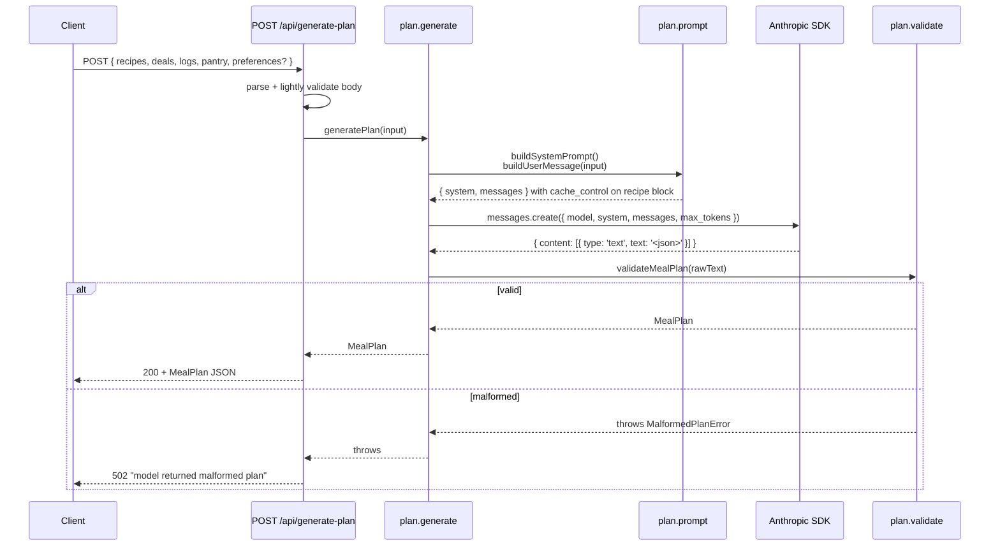

# feat: Meal plan generator (/api/generate-plan powered by Claude with store context)

## Overview

Adds `POST /api/generate-plan`, the third feature on the post-strip stack. It accepts a payload of recipes, deals, recent meal logs, and pantry items, and returns a one-week `MealPlan` (5 dinners + grouped grocery list) generated by Claude. The route composes a structured prompt that includes a fixed store-priority block, the week's Aldi + Safeway sale items, the recipe library (titles/tags/kid-version flag, no full content), recent meal logs (to avoid repeats), and pantry staples (to omit from the grocery list). Claude is asked to return JSON matching the `MealPlan` contract; the route parses, validates, and returns it.

This becomes the engine that turns the `/api/recipes` (#64) and `/api/deals` (#65) outputs into something the UI (#67) can render. Logs (#68) and pantry (#69) inputs are accepted now but expected to be empty arrays until those features land — the contract is forward-compatible.

---

## Problem Frame

The meal-assistant needs a "what's for dinner this week + what to buy" engine. The previous Gemini implementation was stripped in #63; the issue rewrites it on Claude with richer context (deals, logs, pantry, store-priority). The interesting design pressure is on prompt construction and output validation, not on inference plumbing — Claude returns free-form text by default, and we need a strict shape downstream.

Constraints shaping the design:

- **Single-household, low frequency.** A few generations per week. Latency budgets are loose (10–60s acceptable), but reliability and shape-stability matter — the UI cannot recover from a malformed `MealPlan`.
- **Strict output contract.** The issue defines a precise `MealPlan` interface. The route must return exactly that shape; field drift will break #67.
- **Inputs are externally sourced.** Recipes/deals/logs/pantry come from the client (which fetched them from `/api/recipes` and `/api/deals`). The route must validate enough to fail fast on garbage, but shouldn't re-fetch.
- **Model choice has a bake-in cost.** The issue names `claude-sonnet-4-20250514`, but Sonnet 4.6 (`claude-sonnet-4-6`) is the current default per house style. We use 4.6, document the deviation, and make the model a constant so future swaps are mechanical.
- **API key is server-only.** `ANTHROPIC_API_KEY` lives in env, never reaches the client. Same posture as `GITHUB_PAT`.

Origin issue: https://github.com/dancj/meal-assistant/issues/66

---

## Requirements Trace

- R1. `POST /api/generate-plan` accepts a JSON body `{ recipes, deals, logs, pantry, preferences? }` and returns a `MealPlan` JSON response.
- R2. The response body matches the `MealPlan` shape exactly: `meals: { title, kidVersion, dealMatches[] }[]` and `groceryList: { item, quantity, store, dealMatch }[]`. `store` is `'aldi' | 'safeway' | 'costco' | 'wegmans'`.
- R3. Exactly 5 meals are returned per generation.
- R4. Every meal whose source recipe has a non-null `kidVersion` has a non-null `kidVersion` field on the response (mirrors the source recipe's modification).
- R5. The grocery list omits items whose name matches any pantry entry (case-insensitive substring match against the pantry list).
- R6. The grocery list is grouped by store via the `store` field on each item; items also flag deal matches via `dealMatch` when their name overlaps with a `Deal.productName` (loose case-insensitive overlap, populated with `salePrice` and `validTo` from the matching deal).
- R7. Store assignment follows the priority block: Aldi/Safeway when an item is in the deal list for that store, Costco for bulk proteins (≥ 2 lb), Wegmans for specialty/uncommon items, Aldi as the everyday default. The block is communicated to Claude in the system prompt; per-item assignment is the model's responsibility.
- R8. Claude is invoked with model `claude-sonnet-4-6` (deviation from the issue's `claude-sonnet-4-20250514` documented in Key Technical Decisions). The model name lives as a single constant in `src/lib/plan/anthropic.ts`.
- R9. `ANTHROPIC_API_KEY` is required; missing env returns HTTP 500 with a clear message naming the missing var (no value interpolation).
- R10. Invalid request body (not JSON, missing required arrays, wrong types) returns HTTP 400 with a message identifying the offending field.
- R11. Anthropic API errors propagate as HTTP 502 with the upstream status surfaced; network/timeout errors propagate as HTTP 502 with a generic message.
- R12. A 60-second `AbortController` timeout caps the upstream call. Timeout surfaces as HTTP 502.
- R13. Claude's response is parsed as JSON and validated against the `MealPlan` shape. A non-JSON or shape-violating response returns HTTP 502 with a clear "model returned malformed plan" message; the raw response is logged server-side.
- R14. The recipe list block in the user message uses the Anthropic prompt-cache `cache_control: { type: "ephemeral" }` marker so subsequent generations within the 5-minute cache TTL pay reduced input cost. (Forward-compatible — no behavior change if cache misses.)
- R15. `.env.example` advertises `ANTHROPIC_API_KEY` with a safe placeholder.
- R16. `CLAUDE.md`'s "Active Work" entry for #66 is updated from "planned" to the current endpoint + env-var description after merge.
- R17. `README.md` is updated to document the new requirement: `ANTHROPIC_API_KEY` (required for `/api/generate-plan`), with a one-line note that the Anthropic API is paid (no free tier) and a link to https://console.anthropic.com for obtaining a key. Also remove the stale "only RESEND_* keys" hint in the Getting Started section.
- R18. `npm run lint`, `npm test`, `npx tsc --noEmit`, and `npm run build` all succeed.

**Origin actors:** end-user (initiates generation via UI), Claude (model), the recipe/deals/logs/pantry data sources (already-implemented #64, #65; future #68, #69).
**Origin flows:** user requests plan → client gathers context (recipes, deals, logs, pantry) → POST `/api/generate-plan` → Claude returns plan → render in UI.

---

## Scope Boundaries

- No client-side state, UI components, or React hooks. The endpoint is consumed by #67 in a separate PR.
- No streaming. The endpoint is request/response only. The UI may add a loading state, but the wire format stays one POST → one JSON response.
- No persistence. The plan is not stored server-side. Logging meals (#68) and reading meals (#69 pantry) are separate features; this endpoint only consumes them.
- No cost telemetry, usage logging, or rate limiting. Single-household posture.
- No auth on the route itself. Same posture as `/api/recipes` and `/api/deals` — protection is at the Vercel layer.
- No retries on Anthropic errors. One shot, propagate failure to caller. The user can re-invoke.
- No model-selection knob. Model is a constant. Swapping models is a code change, not a request param.
- No prompt-engineering loop / multi-turn refinement. Single-shot generation.
- No tool use / function-calling on the Anthropic side. We use direct JSON output (instructed in the prompt) plus server-side schema validation. Tool use is a heavier abstraction than this use case warrants.
- No grocery-list quantity arithmetic on our side. Claude is asked to combine quantities across recipes; we do not post-process or sum.

### Deferred to Follow-Up Work

- Real meal-log input wiring: #68 will populate `logs` from monthly files in the recipes repo; until then the client passes `[]`.
- Real pantry input wiring: #69 will populate `pantry` from `/pantry.md`; until then the client passes `[]`.
- UI: #67.
- Optional email of the generated plan: #70.

---

## Context & Research

### Relevant Code and Patterns

- **Route convention.** `src/app/api/recipes/route.ts` and `src/app/api/deals/route.ts` are the templates: a thin handler that reads env, calls a lib function, catches named error classes via `instanceof`, and maps to HTTP status with `Response.json(...)`. Mirror that shape for `src/app/api/generate-plan/route.ts`.
- **Lib structure.** Both implemented features colocate `types.ts` (pure types), parser/validator, and an I/O module (`github.ts`, `flipp.ts`). Mirror with `src/lib/plan/` containing `types.ts`, `prompt.ts`, `validate.ts`, `anthropic.ts`, `generate.ts`.
- **Lazy client factory.** `src/lib/resend.ts` is the existing pattern for "construct an SDK client at first call, throw a named error if the env var is missing." Mirror for the Anthropic client. This keeps the route handler import-time cheap and lets tests stub at the factory boundary.
- **Named error classes for route mapping.** `src/lib/recipes/github.ts` (`GitHubAuthError`, `GitHubNotFoundError`, `GitHubUpstreamError`, `MissingEnvVarError`) is the canonical example. Add `MissingEnvVarError`, `InvalidRequestError`, `AnthropicUpstreamError`, `AnthropicNetworkError`, `MalformedPlanError` for this feature.
- **Test patterns.** `src/lib/recipes/github.test.ts` for fetch-stubbing tests; `src/lib/deals/parse.test.ts` for pure-function tests. `src/app/api/recipes/route.test.ts` (if it exists) or the structure described in `2026-04-23-001-feat-github-recipes-api-plan.md` for route tests using `vi.mock("@/lib/plan/generate", ...)`.
- **Vitest config.** `vitest.config.ts` runs `environment: "node"`, so `fetch` is the platform global.
- **Recipe shape.** `src/lib/recipes/types.ts` — `Recipe { title, tags[], kidVersion: string|null, content, filename }`. The prompt sends only `title`, `tags`, and a boolean `hasKidVersion` flag (full content omitted to keep input tokens reasonable).
- **Deal shape.** `src/lib/deals/types.ts` — `Deal { productName, brand, salePrice, regularPrice, promoType, validFrom, validTo, store }`. Passed to Claude as a compact list grouped by store.

### Institutional Learnings

- `~/.claude/projects/-Users-developer-projects-meal-assistant/memory/feedback_no_pii_in_public_repo.md`: `.env.example` and docs must use placeholder values. Apply when writing U1 (env example) and U6 (CLAUDE.md update).
- `docs/plans/2026-04-23-001-feat-github-recipes-api-plan.md` and `docs/plans/2026-04-24-001-feat-deals-api-flipp-plan.md`: established the "thin route + lib split + named error classes + instanceof mapping + lazy env access" pattern this plan reuses wholesale.

### External References

- Anthropic Messages API: https://docs.anthropic.com/en/api/messages — request shape, system + messages structure, response format.
- Prompt caching: https://docs.anthropic.com/en/docs/build-with-claude/prompt-caching — `cache_control: { type: "ephemeral" }` markers, 5-minute default TTL, minimum cacheable block size (~1024 tokens for Sonnet). Recipe list block typically meets this for libraries with 20+ recipes; if smaller, the marker is a no-op (no error).
- `@anthropic-ai/sdk` (Node SDK): https://github.com/anthropics/anthropic-sdk-typescript — `new Anthropic({ apiKey })`, `client.messages.create({ model, max_tokens, system, messages })`. Use the SDK rather than raw `fetch` so we get typed responses, retry-friendly errors, and prompt-cache helpers.

---

## Key Technical Decisions

- **Model: `claude-sonnet-4-6`, not the issue's `claude-sonnet-4-20250514`.** Per house style (system instructions: "default to the latest and most capable Claude models"), Sonnet 4.6 is the current default. `claude-sonnet-4-20250514` is an older Sonnet 4 snapshot. The issue was written before 4.6 landed. We codify the decision as a single `MODEL` constant so a future bump (4.7 / 5.0) is one line.
- **Use the official `@anthropic-ai/sdk`, not raw fetch.** Typed responses, structured error classes (`Anthropic.APIError`), and built-in support for the `cache_control` marker. Adds one dependency we'd otherwise reinvent.
- **JSON output via prompt instruction + server-side validation, not tool use.** The Messages API supports tool use as a way to enforce structured output, but for a single-shot generation with no actual tool execution, it's heavier than instructing the model to "respond with a JSON object matching the following TypeScript shape" and validating on the server. If shape compliance turns out to be unreliable in practice, switch to `tool_choice: { type: "tool", name: "submit_plan" }` as a follow-up — that's a one-file change.
- **Prompt caching on the recipe list block only.** Recipes are stable across generations within a session (same library, same week). Deals/logs/pantry change weekly or per-call. Marking the recipe block (and the static system prompt) with `cache_control: { type: "ephemeral" }` is the highest-leverage cache placement. If the block is below the model's minimum cacheable size, the marker is silently ignored — no behavior change.
- **System prompt vs. user message split.** Static rules (output format, store-priority block, "5 dinners, prefer sale items, omit pantry, group by store") live in the system prompt. Variable inputs (recipes, deals, logs, pantry, preferences) live in the user message. This is the conventional split and keeps the system prompt cacheable.
- **Recipe payload to the model is `{ title, tags, hasKidVersion }`, not full markdown.** Full recipe content would balloon input tokens for no benefit — the model only needs to pick titles and decide whether a kid modification applies. The route does not need to send instructions or ingredient lists; the user already has the recipes.
- **Shape validation is hand-rolled, not Zod.** The repo has no Zod dependency today. Adding it for one validator is more weight than warranted. A small recursive validator in `src/lib/plan/validate.ts` returns `MealPlan` or throws `MalformedPlanError` with a path to the offending field. If validation grows beyond ~80 lines, revisit the dependency call.
- **Input validation is lightweight.** Required arrays must be arrays; required scalar fields must be the right primitive type. We do not deep-validate every recipe/deal field — those came from our own endpoints and the cost of being strict outweighs the benefit.
- **60-second timeout via `AbortController`.** Generation typically lands in 10–30s. 60s gives headroom for slower runs without leaving a serverless lambda hanging indefinitely. Per-attempt, no retries (per Scope Boundaries).
- **All shape decisions are server-authoritative.** The issue's TypeScript interface is the contract; the validator enforces it. If Claude returns extra fields, they're stripped (validator returns only known keys); if Claude omits required fields, it's a 502.
- **Empty `logs` and `pantry` are valid inputs.** The contract accepts `[]` for both. The system prompt phrasing handles "no logs / no pantry" naturally ("If logs is empty, no avoidance needed; if pantry is empty, include staples in the grocery list").
- **`preferences` is an opt-in free-text string.** Passed through to Claude verbatim in the user message when present, omitted when not. We do not parse it.
- **`runtime = "nodejs"`.** Same as the other routes. The Anthropic SDK uses Node-specific APIs; Edge runtime is not supported.

---

## Open Questions

### Resolved During Planning

- **Model choice — issue-specified `claude-sonnet-4-20250514` or current default?** Use `claude-sonnet-4-6`, document the deviation. See Key Technical Decisions.
- **Tool use vs. JSON-in-prompt for structured output?** JSON-in-prompt + server validation. Switch to tool use only if shape compliance proves unreliable in practice.
- **Should recipe content be sent to Claude?** No. Title + tags + `hasKidVersion` flag is enough for the picking decision and saves substantial input tokens.
- **How is store assignment per grocery item decided?** Claude does it in-prompt, following the store-priority block. Server does no rule application.
- **Where does pantry filtering happen?** Claude does it (the prompt instructs "do not include pantry items in the grocery list"). The validator does not re-filter. If the model includes a pantry item, it's a soft failure we accept this iteration; revisit if it happens often.
- **What happens if logs/pantry arrays are empty?** Treated as "no constraint." Endpoint succeeds normally. The prompt explicitly handles both empty cases.
- **Validation library — Zod or hand-rolled?** Hand-rolled, single file. See Key Technical Decisions.
- **Body size / input limits?** No explicit cap. The Anthropic API has a 200K context window; a typical request (50 recipes + 100 deals + 30 logs + 20 pantry items) is well under 10K tokens. If a user's recipe library grows past that, revisit.
- **Auth on the route?** None at the app layer. Same posture as the other routes.

### Deferred to Implementation

- **Exact temperature / max_tokens.** Start with `temperature: 0.7`, `max_tokens: 4096`. Tune during U4 if outputs are too repetitive (raise temp) or get truncated (raise max_tokens).
- **Whether the JSON-in-prompt instruction is reliable enough.** First implementation uses an explicit "respond with ONLY a JSON object matching this schema, no prose, no code fences" instruction. If response prefixes/suffixes show up frequently, add a strip-fence helper to the validator. If shape compliance is unreliable, escalate to tool use as noted in Key Technical Decisions.
- **Whether the prompt-cache marker meaningfully reduces cost in practice.** Recipe libraries below ~1024 tokens won't trigger caching. Confirm during implementation by inspecting the response's `usage.cache_creation_input_tokens` and `usage.cache_read_input_tokens`. If the library is too small to cache, leave the marker in place (it's harmless) and revisit when the library grows.
- **System prompt wording.** A draft lives in U3's approach notes; final wording will be tightened during implementation against actual model output.

---

## High-Level Technical Design

> *This illustrates the intended request/response shape and is directional guidance for review, not implementation specification. The implementing agent should treat it as context, not code to reproduce.*



The key shape points: the route is a thin error-mapping layer; all prompt construction, model invocation, and validation live in `src/lib/plan/`; the validator is the single source of truth for output shape conformance.

---

## Output Structure

    src/
      app/
        api/
          generate-plan/
            route.ts
            route.test.ts
      lib/
        plan/
          types.ts
          errors.ts
          anthropic.ts
          prompt.ts
          prompt.test.ts
          validate.ts
          validate.test.ts
          generate.ts
          generate.test.ts

---

## Implementation Units

- U1. **Plan types, errors, and env scaffolding**

**Goal:** Establish the `MealPlan` / `GeneratePlanInput` types, named error classes for route mapping, the model constant, and `.env.example` entry. No logic — only the shared vocabulary subsequent units depend on.

**Requirements:** R2, R8, R9, R15

**Dependencies:** None

**Files:**
- Create: `src/lib/plan/types.ts` — `MealPlan`, `MealPlanMeal`, `MealPlanGroceryItem`, `DealMatch`, `Store` (`'aldi' | 'safeway' | 'costco' | 'wegmans'`), `GeneratePlanInput { recipes: Recipe[], deals: Deal[], logs: MealLog[], pantry: string[], preferences?: string }`, `MealLog { date: string, title: string }` (placeholder shape — #68 will refine).
- Create: `src/lib/plan/errors.ts` — `MissingEnvVarError`, `InvalidRequestError` (carries `field`), `AnthropicUpstreamError` (carries upstream `status` and message), `AnthropicNetworkError`, `MalformedPlanError` (carries `path` to offending field). Mirror naming conventions from `src/lib/recipes/github.ts` and `src/lib/deals/errors.ts`.
- Modify: `.env.example` — add `ANTHROPIC_API_KEY=your-anthropic-api-key` block with one-line comment.

**Approach:**
- Re-export `Recipe` from `@/lib/recipes/types` and `Deal` from `@/lib/deals/types` rather than redeclaring; the input contract reuses them.
- `MealLog` is a new placeholder type; #68 will own its real shape. Keep it minimal (`date`, `title`) so this PR doesn't accidentally fix the schema before #68.
- `Store` union here intentionally differs from `Deal['store']` (`'safeway' | 'aldi'`) — the meal plan adds Costco and Wegmans, which never produce `Deal` rows.

**Patterns to follow:**
- Type-module colocation from `src/lib/recipes/types.ts` and `src/lib/deals/types.ts`.
- Named-error pattern from `src/lib/recipes/github.ts` and `src/lib/deals/errors.ts`.

**Test scenarios:**
- Test expectation: none -- pure type/constant declarations and an env example. No behavior to verify here; subsequent units exercise these via integration tests.

**Verification:**
- `npx tsc --noEmit` passes.
- `.env.example` parses cleanly (no malformed lines).

---

- U2. **Anthropic client factory and model constant**

**Goal:** Provide a lazy `getAnthropicClient()` factory that constructs `new Anthropic({ apiKey })` on first call, throwing `MissingEnvVarError` when `ANTHROPIC_API_KEY` is unset. Export the `MODEL` constant.

**Requirements:** R8, R9

**Dependencies:** U1

**Files:**
- Modify: `package.json` — add `@anthropic-ai/sdk` dependency (pin a recent stable version, e.g., `^0.40.0` or current latest; let the install resolve the minor).
- Create: `src/lib/plan/anthropic.ts` — `MODEL = "claude-sonnet-4-6"` constant, `getAnthropicClient(): Anthropic` factory, `MAX_TOKENS = 4096`, `TEMPERATURE = 0.7`, `TIMEOUT_MS = 60_000`.
- Create: `src/lib/plan/anthropic.test.ts` — factory + missing-env tests.

**Approach:**
- Mirror `src/lib/resend.ts`'s lazy-construction pattern: read `process.env.ANTHROPIC_API_KEY` inside the factory (not at module load) so tests can stub per-case via `vi.stubEnv`.
- Cache the client instance at module scope after first construction (one client per process is fine).
- `MAX_TOKENS`, `TEMPERATURE`, and `TIMEOUT_MS` colocate here so tuning is one file.

**Patterns to follow:**
- Lazy client factory from `src/lib/resend.ts`.
- Env-var + named-error pattern from `src/lib/recipes/github.ts`'s `requireEnv` / `MissingEnvVarError`.

**Test scenarios:**
- Happy path: with `ANTHROPIC_API_KEY` set, `getAnthropicClient()` returns an `Anthropic` instance. Covers R8.
- Happy path: calling `getAnthropicClient()` twice returns the same instance (memoized).
- Error path: with `ANTHROPIC_API_KEY` unset, `getAnthropicClient()` throws `MissingEnvVarError` whose message names `ANTHROPIC_API_KEY` and does not interpolate any value. Covers R9.
- Error path: with `ANTHROPIC_API_KEY` empty string, throws `MissingEnvVarError` (treat empty as unset).

**Verification:**
- Tests pass.
- The client instance is not constructed at module-load time (verifiable by importing the module without `ANTHROPIC_API_KEY` set and observing no throw until the factory is called).

---

- U3. **Prompt builder (system prompt + user message + cache marker)**

**Goal:** A pure function that turns `GeneratePlanInput` into `{ system, messages }` for the Anthropic Messages API, with `cache_control: { type: "ephemeral" }` on the recipe block.

**Requirements:** R6, R7, R14

**Dependencies:** U1

**Files:**
- Create: `src/lib/plan/prompt.ts` — exports `buildSystemPrompt(): string`, `buildUserMessage(input: GeneratePlanInput): MessageParam[]`, and a top-level `buildPrompt(input)` returning `{ system, messages }` ready for `messages.create`.
- Create: `src/lib/plan/prompt.test.ts` — pure tests over the returned strings/structures.

**Approach:**
- **System prompt** (static, cached) contains:
  1. Role: "You are a meal-planning assistant for a single household."
  2. Task: "Pick 5 dinners from the provided recipe list for the upcoming week."
  3. Output format spec — verbatim TypeScript interface for `MealPlan`, plus "Respond with ONLY a JSON object matching this schema. No prose. No markdown code fences. No comments."
  4. Picking rules: prefer recipes whose main ingredients overlap with this week's deals; avoid recipes whose titles appear in recent logs; mirror `kidVersion` when the source recipe has one.
  5. Grocery-list rules: omit pantry items; group by store; flag deal matches.
  6. Store-priority block (verbatim from the issue):
     ```
     Available stores:
     - Aldi (everyday staples, produce — check first)
     - Safeway (weekly sales — this week's deals provided)
     - Costco (bulk proteins/staples when buying in quantity)
     - Wegmans via Instacart (specialty ingredients)

     For each grocery list item, assign the most cost-effective store.
     Group the final grocery list by store.
     Heuristics: bulk proteins ≥ 2 lb → Costco; specialty/uncommon → Wegmans;
     items in this week's Aldi/Safeway deals → that store; otherwise default to Aldi.
     ```
- **User message** is a single text block built by concatenating clearly-labeled sections in this order:
  1. **Recipe library** (with `cache_control: { type: "ephemeral" }`): JSON-stringified array of `{ title, tags, hasKidVersion }`. Most stable across calls.
  2. **This week's deals**: JSON-stringified `Deal[]` grouped by store.
  3. **Recent meal logs** (last ~8 weeks): JSON-stringified `MealLog[]`. Empty array if none provided.
  4. **Pantry**: JSON-stringified string[]. Empty array if none provided.
  5. **Preferences**: included verbatim only when `input.preferences` is a non-empty string.
- The recipe block is its own content block in the messages array so the cache marker applies to it specifically. Other inputs concatenate into a second content block (no cache marker — they change per call).
- Per Anthropic docs, `cache_control` is set on the *last* block of the cacheable prefix. Layout: `[ { type: 'text', text: '<recipe block>', cache_control: { type: 'ephemeral' } }, { type: 'text', text: '<other inputs>' } ]`.

**Technical design:** *(directional — final wording is tuned during implementation)*

```text
buildPrompt(input) returns:
  {
    system: <static system prompt with store-priority block>,
    messages: [
      {
        role: 'user',
        content: [
          {
            type: 'text',
            text: 'RECIPE LIBRARY (stable across this week):\n' + JSON.stringify(stripRecipes(input.recipes)),
            cache_control: { type: 'ephemeral' },
          },
          {
            type: 'text',
            text: [
              'THIS WEEK\'S DEALS:\n' + JSON.stringify(groupDealsByStore(input.deals)),
              'RECENT MEAL LOGS (avoid repeats):\n' + JSON.stringify(input.logs),
              'PANTRY (omit from grocery list):\n' + JSON.stringify(input.pantry),
              input.preferences ? 'USER PREFERENCES:\n' + input.preferences : null,
            ].filter(Boolean).join('\n\n'),
          },
        ],
      },
    ],
  }
```

**Patterns to follow:**
- Pure-function module style from `src/lib/deals/parse.ts` (no I/O, fully deterministic, easily testable inline).

**Test scenarios:**
- Happy path: `buildSystemPrompt()` includes the verbatim store-priority block, the `MealPlan` TypeScript interface, and the "JSON only, no fences" instruction. Covers R7.
- Happy path: `buildUserMessage` with full input produces a two-block content array; the first block has `cache_control: { type: 'ephemeral' }` and contains the recipe library; the second has no cache marker and contains deals + logs + pantry. Covers R14.
- Happy path: recipe block contains `{ title, tags, hasKidVersion: boolean }` for each input recipe — full `content` field is NOT included.
- Edge case: `logs: []` and `pantry: []` produce a user message that still includes the labels but with empty arrays — the model is told there are none, not omitted entirely. Covers R5 boundary.
- Edge case: `preferences` omitted produces no preferences section in the user message; `preferences: ""` is treated as omitted; `preferences: "no shellfish"` includes a `USER PREFERENCES:\nno shellfish` section.
- Edge case: `deals: []` produces a deals section with `[]` — does not crash, does not omit the section.

**Verification:**
- All scenarios pass.
- The function is pure (no `process.env`, no `fetch`, no `Date.now()` calls).

---

- U4. **Output validator (raw text → MealPlan or MalformedPlanError)**

**Goal:** A pure function that parses Claude's response text as JSON, validates it against the `MealPlan` shape, and returns a typed `MealPlan` or throws `MalformedPlanError` with a path to the offending field.

**Requirements:** R2, R3, R13

**Dependencies:** U1

**Files:**
- Create: `src/lib/plan/validate.ts` — `validateMealPlan(rawText: string): MealPlan`. Strips optional code fences (\`\`\`json … \`\`\`), parses JSON, walks the object asserting every required field is the right type. Throws `MalformedPlanError` with the field path on any violation.
- Create: `src/lib/plan/validate.test.ts` — exhaustive shape tests.

**Approach:**
- Strip leading/trailing whitespace, then strip a single optional code fence wrapper (`^```(?:json)?\s*\n([\s\S]*?)\n```\s*$`). If neither pattern matches, parse the raw text directly.
- `JSON.parse` with try/catch — on failure throw `MalformedPlanError` with path `<root>` and reason `not valid JSON`.
- Recursive walker:
  - root must be an object with `meals: array` and `groceryList: array`.
  - `meals` must have length 5 (R3) — anything else throws with path `meals` and a message naming the actual count.
  - Each meal: `title: non-empty string`, `kidVersion: string | null`, `dealMatches: array of { item: string, salePrice: string, store: string }`.
  - Each grocery item: `item: non-empty string`, `quantity: string` (allow empty), `store: one of 'aldi'|'safeway'|'costco'|'wegmans'`, `dealMatch: { salePrice: string, validTo: string } | null`.
- Returns only the validated keys (extra keys are dropped, not errors).
- The validator does NOT enforce R4 (kidVersion mirroring) — that requires the input recipes for cross-reference. Cross-validation lives in U5 if we add it; for now, the model is trusted to mirror.
- The validator does NOT enforce R5 (pantry omission) or R6 (deal flagging correctness) — those are the model's responsibility. Validator only enforces *shape*, not *semantic correctness*. This is documented at the top of the file.

**Patterns to follow:**
- Pure-function + named-error pattern from `src/lib/recipes/parse.ts` and its `RecipeParseError`.

**Test scenarios:**
- Happy path: valid JSON with 5 meals and a populated grocery list parses cleanly.
- Happy path: response wrapped in \`\`\`json … \`\`\` fences is unwrapped before parsing.
- Happy path: response wrapped in \`\`\` … \`\`\` (no language tag) is unwrapped.
- Happy path: extra unknown keys on meals or grocery items are dropped (returned object only has known keys).
- Happy path: `kidVersion: null` is accepted on a meal.
- Happy path: `dealMatch: null` is accepted on a grocery item.
- Happy path: `dealMatches: []` on a meal is accepted.
- Edge case: trailing whitespace and a trailing prose sentence after the JSON block are stripped via the fence-strip regex when fenced.
- Error path: not JSON at all (`"hello world"`) throws `MalformedPlanError` with path `<root>` mentioning JSON parse.
- Error path: missing `meals` field throws with path `meals`.
- Error path: `meals` length 4 throws with path `meals` mentioning expected 5, got 4. Covers R3.
- Error path: `meals` length 6 throws with path `meals` mentioning expected 5, got 6.
- Error path: `meals[0].title: ""` (empty string) throws with path `meals[0].title`.
- Error path: `meals[0].title: 123` throws with path `meals[0].title`.
- Error path: `meals[0].kidVersion: 123` throws with path `meals[0].kidVersion`.
- Error path: `meals[0].dealMatches: "x"` throws with path `meals[0].dealMatches`.
- Error path: `groceryList[0].store: "wholefoods"` throws with path `groceryList[0].store` mentioning the allowed set.
- Error path: `groceryList[0].dealMatch: { salePrice: 1.99 }` (number, not string) throws with path `groceryList[0].dealMatch.salePrice`.
- Error path: response is fenced but inner content is invalid JSON — error path correctly flags `<root>` after stripping fences.

**Verification:**
- All scenarios pass.
- The function is pure: same input always yields same output or same error.

---

- U5. **Generator orchestrator (input validation + Anthropic call + validation)**

**Goal:** The end-to-end pipeline. Validate the request body, build the prompt, call Claude with timeout, validate the response, return a `MealPlan` or throw a typed error.

**Requirements:** R1, R10, R11, R12, R13, R14

**Dependencies:** U1, U2, U3, U4

**Files:**
- Create: `src/lib/plan/generate.ts` — `validateInput(body: unknown): GeneratePlanInput` (lightweight type guard) and `generatePlan(input: GeneratePlanInput): Promise<MealPlan>` (full pipeline).
- Create: `src/lib/plan/generate.test.ts` — orchestrator tests stubbing the Anthropic client.

**Approach:**
- `validateInput` walks the body once: must be an object; `recipes`, `deals`, `logs`, `pantry` must be arrays; `preferences` must be string-or-undefined. Throws `InvalidRequestError` with the offending field on any violation. Does NOT deep-validate each recipe/deal — they came from our own endpoints.
- `generatePlan` calls `getAnthropicClient()`, builds the prompt via `buildPrompt(input)`, calls `client.messages.create({ model: MODEL, max_tokens: MAX_TOKENS, temperature: TEMPERATURE, system, messages, ... })` with a 60s `AbortController` (`signal` option on the SDK call).
- Wraps the SDK call in try/catch. The Anthropic SDK throws `Anthropic.APIError` subclasses for non-2xx (status on the error). Map: any `APIError` → `AnthropicUpstreamError(status, message)`. Any other thrown value → `AnthropicNetworkError(cause)`. Treat `AbortError` as `AnthropicNetworkError` with message "request timed out".
- On success, extract the first text block from the response (`response.content.find(b => b.type === 'text')?.text`). If no text block exists, throw `MalformedPlanError` with reason "no text block in response".
- Pass the text to `validateMealPlan(text)`. Re-throws are propagated as-is.
- Stub-friendly: tests inject the client via a parameter or `vi.mock("@/lib/plan/anthropic", ...)`.

**Execution note:** Test-first for the validator integration — write the orchestrator tests with stubbed responses (happy + each error class) before wiring the real SDK call. This keeps the contract sharp before SDK quirks creep in.

**Patterns to follow:**
- Orchestrator-with-stubbable-deps pattern from `src/lib/deals/flipp.ts` (`fetchAllDeals` orchestrating `fetchDealsFromFlipp` per store).
- Named-error-class wrapping pattern from `src/lib/deals/flipp.ts` (mapping native fetch errors into `FlippNetworkError` / `FlippUpstreamError`).

**Test scenarios:**
- Happy path: `validateInput` accepts a well-formed body and returns a typed `GeneratePlanInput`. Covers R10.
- Happy path: `validateInput` accepts `preferences` omitted.
- Happy path: `validateInput` accepts `preferences: "no shellfish"`.
- Happy path: `generatePlan` calls Claude once, parses the returned text via `validateMealPlan`, and returns the resulting `MealPlan`. Covers R1.
- Happy path: `generatePlan` invokes the SDK with `model: "claude-sonnet-4-6"`, `max_tokens: 4096`, the system prompt and messages from `buildPrompt`. Covers R8, R14.
- Edge case: response with multiple content blocks picks the first `text`-type block.
- Error path: body is not an object (`null`, `[]`, `"x"`) → `InvalidRequestError`.
- Error path: `recipes` missing → `InvalidRequestError` with field `recipes`. Covers R10.
- Error path: `deals: "x"` (not an array) → `InvalidRequestError` with field `deals`.
- Error path: `pantry: [1, 2]` (not strings) → `InvalidRequestError` with field `pantry`.
- Error path: `preferences: 123` → `InvalidRequestError` with field `preferences`.
- Error path: SDK throws an `APIError` with status 401 → `AnthropicUpstreamError(401, ...)`. Covers R11.
- Error path: SDK throws an `APIError` with status 529 (overloaded) → `AnthropicUpstreamError(529, ...)`.
- Error path: SDK throws a generic `Error("network failure")` → `AnthropicNetworkError`.
- Error path: `AbortController` fires after timeout → `AnthropicNetworkError` with "timed out" in the message. Covers R12.
- Error path: response has no text content blocks → `MalformedPlanError`.
- Error path: response text is invalid JSON → `MalformedPlanError` (propagated from `validateMealPlan`). Covers R13.
- Integration: end-to-end stub — full input through `validateInput` → `buildPrompt` → stubbed SDK returning a valid JSON string → `validateMealPlan` → returned `MealPlan`. Verifies the units compose correctly.

**Verification:**
- All scenarios pass.
- The Anthropic SDK is the only network-touching dependency, and it's stubbable.

---

- U6. **Route handler (`POST /api/generate-plan`)**

**Goal:** Thin error-mapping layer: parse body, call `generatePlan`, return JSON or map errors to status codes. Mirror the established route shape.

**Requirements:** R1, R9, R10, R11, R12, R13, R16, R17, R18

**Dependencies:** U5

**Files:**
- Create: `src/app/api/generate-plan/route.ts` — `POST` handler.
- Create: `src/app/api/generate-plan/route.test.ts` — route tests via `vi.mock("@/lib/plan/generate", ...)`.
- Modify: `CLAUDE.md` — update the #66 entry in "Active Work" from "planned" to the implemented endpoint + env var description.
- Modify: `README.md` — under a new or expanded "Environment & API keys" subsection of Getting Started, document `ANTHROPIC_API_KEY` as required for `/api/generate-plan`, note that the Anthropic API is paid (no free tier; typical generation costs a few cents in tokens), and link to https://console.anthropic.com. Remove the stale "only RESEND_* keys, used once #70 lands" parenthetical so the env hint stays accurate.

**Approach:**
- `export const runtime = "nodejs"` (Anthropic SDK requires Node).
- `POST` handler:
  1. `await request.json()` inside try/catch — on parse failure return 400 `{ error: "Request body must be valid JSON" }`.
  2. `validateInput(body)` — on `InvalidRequestError` return 400 `{ error: <message including field> }`.
  3. `generatePlan(input)` — map error classes:
     - `MissingEnvVarError` → 500 `{ error: <message naming the var> }`.
     - `AnthropicUpstreamError` → 502 `{ error: "Anthropic upstream error", upstreamStatus: <status> }`.
     - `AnthropicNetworkError` → 502 `{ error: "Anthropic network error" }`.
     - `MalformedPlanError` → 502 `{ error: "Model returned malformed plan", path: <field-path> }`. Also `console.error` the raw text + path so we can debug later (no PII concern — it's the model's output).
     - Anything else → 500 `{ error: "Unexpected error" }` and `console.error(err)`.
  4. On success, `Response.json(mealPlan)` (200, default headers).
- No request size guard — Next.js's default request size limit (4.5MB on Vercel) is comfortably above any plausible recipe library.

**Patterns to follow:**
- Error-class-to-status mapping from `src/app/api/recipes/route.ts` and `src/app/api/deals/route.ts` (verbatim shape).
- Lazy env access (no `requireEnv` at module load) — `getAnthropicClient()` reads env on first call inside `generatePlan`.

**Test scenarios:**
- Happy path: POST with valid body → 200 + the `MealPlan` returned by the stubbed `generatePlan`. Covers R1.
- Edge case: POST with empty body → 400 with "Request body must be valid JSON".
- Edge case: POST with `Content-Type: text/plain` and a non-JSON body → 400.
- Error path: `validateInput` throws `InvalidRequestError("recipes")` → 400 with message naming `recipes`. Covers R10.
- Error path: `generatePlan` throws `MissingEnvVarError("ANTHROPIC_API_KEY")` → 500 with message naming `ANTHROPIC_API_KEY`. Covers R9.
- Error path: `generatePlan` throws `AnthropicUpstreamError(401, "...")` → 502 with `upstreamStatus: 401` in body. Covers R11.
- Error path: `generatePlan` throws `AnthropicUpstreamError(529, "...")` → 502 with `upstreamStatus: 529`.
- Error path: `generatePlan` throws `AnthropicNetworkError` → 502 with "Anthropic network error". Covers R11, R12.
- Error path: `generatePlan` throws `MalformedPlanError("meals", "expected 5 got 4")` → 502 with the field path in the body and the raw response logged via `console.error`. Covers R13.
- Error path: `generatePlan` throws an unexpected `Error` → 500 with "Unexpected error" and the error logged.
- Integration: full request lifecycle (route → mocked generate → response) with realistic input/output payloads.

**Verification:**
- All scenarios pass.
- `npm run lint`, `npm test`, `npx tsc --noEmit`, `npm run build` all succeed. Covers R18.
- `CLAUDE.md` "Active Work" entry for #66 reflects the implemented state. Covers R16.
- `README.md` advertises `ANTHROPIC_API_KEY`, notes that the Anthropic API is paid, and links to the Anthropic console. The stale "only RESEND_* keys" hint is gone. Covers R17.

---

## System-Wide Impact

- **Interaction graph:** This route is the first place the Anthropic SDK enters the project. The lazy client factory (U2) is the only construction site, so future features (re-generation, summarization, etc.) reuse the same pattern.
- **Error propagation:** Five distinct error classes map to three status codes (400/500/502). The mapping is centralized in U6 and mirrors the conventions established in `recipes/route.ts` and `deals/route.ts`.
- **State lifecycle risks:** None — the endpoint is stateless. Anthropic SDK client is memoized at module scope but holds no per-request state.
- **API surface parity:** This is a new public route. No changes to `/api/recipes` or `/api/deals`.
- **Integration coverage:** U5's integration test (full input → stubbed SDK → validated output) and U6's request-lifecycle test together prove the wiring is correct without making real Anthropic calls. A real-call smoke test is intentionally out of scope (depends on a paid API key during CI).
- **Unchanged invariants:** `/api/recipes` and `/api/deals` shapes are unchanged. The `Recipe` and `Deal` types are imported but not modified. The lazy-env-read pattern continues to hold across all routes.

---

## Risks & Dependencies

| Risk | Mitigation |
|------|------------|
| Claude returns text with unexpected wrapping (code fences, prose preface) breaking JSON parse. | Strip optional fences in `validateMealPlan`; if still invalid, return 502 `MalformedPlanError` rather than crashing. If empirically common, escalate to tool use (one-file change, noted in Key Technical Decisions). |
| Claude omits required fields or returns wrong types. | Hand-rolled validator (U4) catches every required field with a path-bearing error. The validator's error feeds the 502 response so the client sees a clean failure, not a broken UI. |
| Claude includes pantry items or fails to flag deal matches. | Soft failures we accept this iteration — the validator does not enforce semantic correctness, only shape. If observed often, tighten the prompt or add a post-processing pass. |
| Recipe library too small for prompt-cache to engage (< ~1024 tokens). | The marker is a no-op below threshold — no error, no cost change. Revisit when the library grows. |
| Model name `claude-sonnet-4-6` rejected by the API at generation time. | Caught at U5 stage as an `AnthropicUpstreamError(404)` or similar; surfaces as 502 with `upstreamStatus`. The model constant is a single line — easy to bump if needed. |
| `@anthropic-ai/sdk` version drift introduces breaking SDK API changes. | Pin a stable version in `package.json`. The SDK is the only thing that touches Anthropic; if the SDK changes, only `generate.ts` and `anthropic.ts` need updating. |
| Long generation times exceed Vercel's default function timeout (10s on free tier, longer on pro). | Set `export const maxDuration = 60` on the route to match the `AbortController` budget (Next.js / Vercel-specific). If the deployment tier doesn't allow 60s, drop to a tier-appropriate value and tighten the timeout. |
| Empty `logs` and `pantry` arrays in initial deployment (until #68 / #69 land) reduce plan quality. | Acceptable — the prompt explicitly handles both empty cases. Plan quality improves automatically once #68 / #69 wire real data. |

---

## Documentation / Operational Notes

- `.env.example` updated with `ANTHROPIC_API_KEY=your-anthropic-api-key`.
- `CLAUDE.md`'s "Active Work" entry for #66 updated post-merge: replace "planned" with the implemented endpoint, env var, and a one-line description of inputs/output (mirroring the #64/#65 entries).
- `README.md` updated to document `ANTHROPIC_API_KEY` as required for `/api/generate-plan`, note the Anthropic API is paid (no free tier; typical generation costs a few cents in tokens), and link to https://console.anthropic.com for obtaining a key. Remove the stale "only RESEND_* keys" hint in the Getting Started section so the env guidance stays accurate as the stack fills in.
- License posture: `@anthropic-ai/sdk` is MIT-licensed; no special obligations beyond an Anthropic commercial-terms account. Self-hosters bring their own paid API key.
- Operational: deployment needs `ANTHROPIC_API_KEY` set in Vercel env vars before this route can be used. Document in the deployment runbook (or PR description) so the rollout doesn't surprise anyone.

---

## Sources & References

- **Origin issue:** https://github.com/dancj/meal-assistant/issues/66
- Related code: `src/app/api/recipes/route.ts`, `src/app/api/deals/route.ts`, `src/lib/recipes/`, `src/lib/deals/`, `src/lib/resend.ts` (lazy factory pattern).
- Related plans: `docs/plans/2026-04-23-001-feat-github-recipes-api-plan.md`, `docs/plans/2026-04-24-001-feat-deals-api-flipp-plan.md`.
- External docs: Anthropic Messages API (https://docs.anthropic.com/en/api/messages), Prompt caching (https://docs.anthropic.com/en/docs/build-with-claude/prompt-caching), `@anthropic-ai/sdk` (https://github.com/anthropics/anthropic-sdk-typescript).
